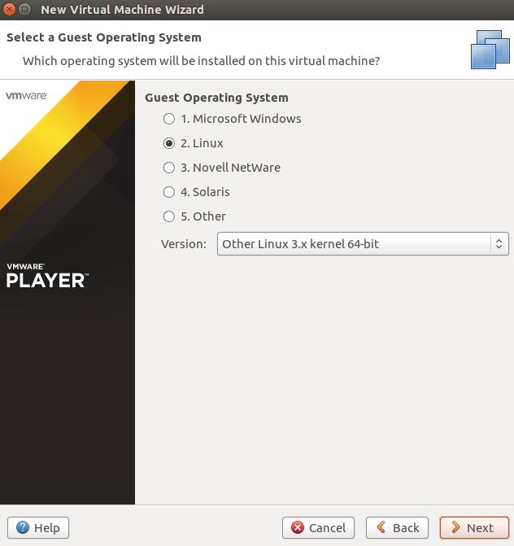

### EJERCICIO 2 :

Lo primero vamos a cargar KVM, ya que por defecto podría no estar cargado, para ello ejecutamos `sudo modprobe kvm-intel`.

######1)

######Creo máquina virtual con SliTaz:

1. Me descargo slitaz -> [DESCARGAR](http://download.tuxfamily.org/slitaz/iso/4.0/slitaz-4.0.iso)

2. Creamos un disco virtual para luego asignarle la imagen descargada con `qemu-img create -f raw slitaz.img 100M`:

 

3. Y le asignamos la imagen descargada con `qemu-system-x86_64 -hda ./slitaz.img -cdrom /home/marquina/Descargas/slitaz-4.0.iso -show-cursor` y se arrancara para instalarla en el disco virtual creado en el paso 2:

 

Tras instalarse ya podemos usarla:

######Creo máquina virtual con  GALPon Minino:

1. Me descargo  GALPon Minino -> [DESCARGAR](http://minino.galpon.org/ISO/minino-artabros-2.1_minimal.iso) (este es más pesado asique podemos ir a tomarnos algo mientras se descarga).

2. Creamos un nuevo disco virtual con `qemu-img create -f raw galpon.img 10000M `(notar que esta vez le hemos asignado más espacio que antes ya que esta distribución también es más pesada).

3. Arranco la máquina virtual desde la imagen para instalarla en el disco con `qemu-system-x86_64 -hda ./galpon.img -cdrom /home/marquina/Descargas/minino-artabros-2.1_minimal.iso -show-cursor`

- - -

- - -
######2)

Como hipervisor voy a elegir VMWare Player, ya que lo tengo instalado.

Para crear la máquina virtual con él, lo arrancamos y seguimos los siguientes pasos:

1. Hacemos clic en "Create a New Virtual Machine".
2. Seleccionamos la opción de usar una Imagen:

 

3. Seleccionamos Sistema Operativo, ya que no lo detecto de primeras:

 

4. Le ponemos un Nombre a la máquina y seleccionamos dónde queremos que se guarde.
5. Crearemos un nuevo disco virtual, seleccionando tamaño, y en tipo de almacenamiento elegimos varios ficheros:

 

6. Y por último personalizamos el Hardware que simulara, y la creamos.

Y ya podemos usar la máquina virtual creada:

 
