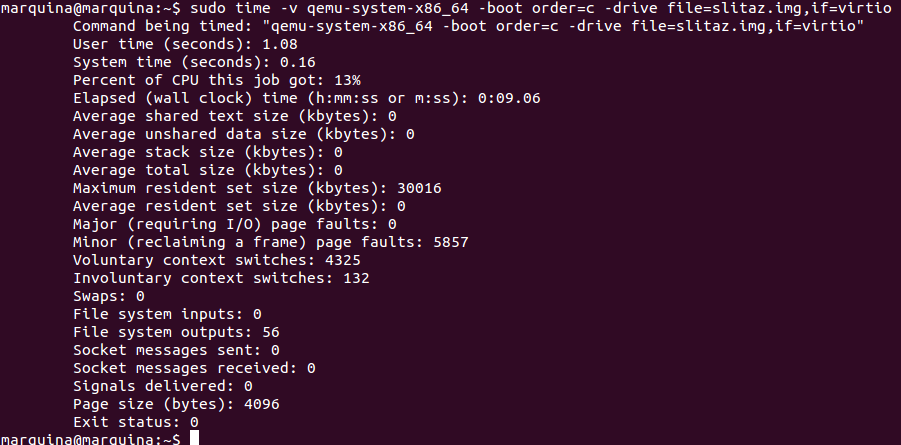
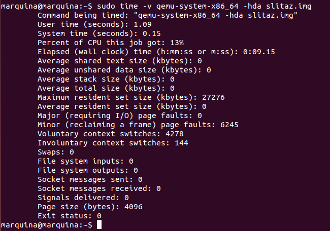

### EJERCICIO 3 :

Siguiendo los apuntes de la asignatura vamos a crear un benchmark de velocidad de entrada y salida, para ello usamos:

1. `sudo time -v qemu-system-x86_64 -boot order=c -drive file=slitaz.img,if=virtio`(indicándolo el uso de virtio, una paravirtualización de la entrada/salida) :

 

2. `sudo time -v qemu-system-x86_64 -hda slitaz.img` :

 
 
Apenas hay diferencias entre ambos, aunque la paravirtualización parece mejor debido a que tiene menos fallos de página menores y menos cambios de contexto involuntarios.