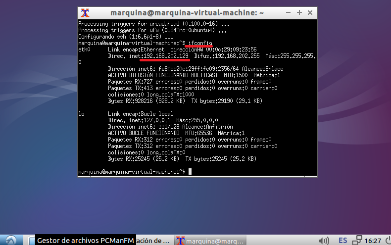

### EJERCICIO 4 :

La distribución [lubuntu 14.10](https://help.ubuntu.com/community/Lubuntu/GetLubuntu#Downloading_Lubuntu_14.10), ya viene por defecto con el entorno de escritorio X11 Liviano, asique lo usare para este ejercicio, para ello lo primero es [descargarselo](http://cdimage.ubuntu.com/lubuntu/releases/14.10/release/lubuntu-14.10-desktop-amd64.iso).
Después creamos un disco virtual dónde lo instalaremos con el comando `qemu-img create -f raw ejercicio4.img 10G`:

Y después arrancamos la imagen descargado en el disco virtual con `qemu-system-x86_64 -hda ejercicio4.img -cdrom /home/marquina/Descargas/lubuntu-14.10-desktop-amd64.iso -m 512M` (dónde le asignamos la memoria RAM):

Tras la instalación ejecutamos una terminal (XTerm), e instalamos ssh con `sudo apt-get install ssh`, y miramos la ip con `ifconfig`:

Cuando ya sabemos la IP accedemos desde la máquina principal con `ssh marquina@192-168.202.129` :

y ya estamos dentro de nuestra máquina virtual usando ssh.

Ahora instalamos vinagre con `sudo apt-get install vinagre`, y accedemos a nuestra máquina virtual mediante él, con el comando `vinagre 192-168.202.129` :

