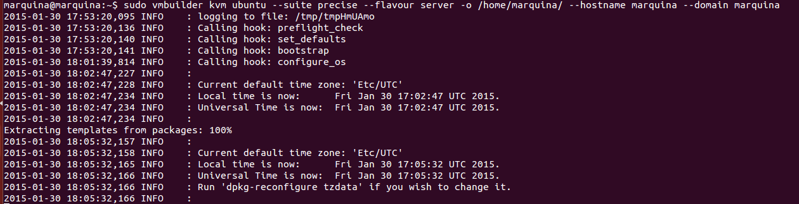

### EJERCICIO  7 :
Primero nos instalamos todos los paquetes que podemos necesitar con ` sudo apt-get install qemu-kvm libvirt-bin ubuntu-vm-builder bridge-utils`

Luego, siguiendo los apuntes de la asignatura creamos la instalación con `sudo vmbuilder kvm ubuntu --suite precise --flavour server -o /home/marquina --hostname marquina --domain marquina`:

Y arrancamos la máquina comprobando que efectivamente se ha instalado correctamente, con el comando `sudo qemu-system-x86_64 -hda /home/marquina/ubuntu-kvm/tmpoStFNP.qcow2` :

Notar que he señalado en rojo en dónde debemos mirar para saber con qué nombre se genera nuestra máquina virtual.