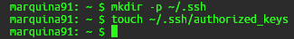
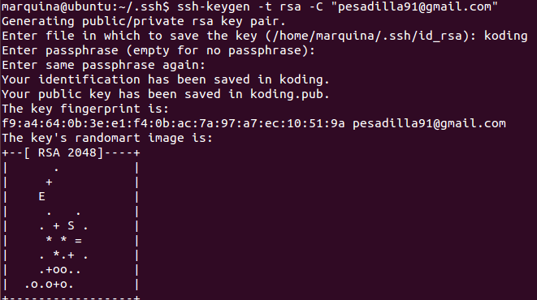
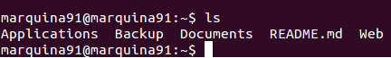
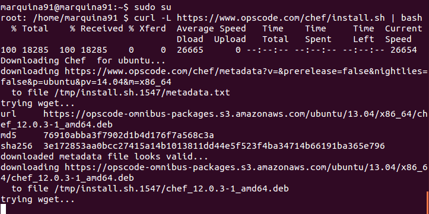
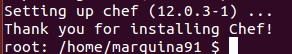

### EJERCICIO  1 :

Para este ejercicio yo he creado una máquina virtual en koding, por lo tanto lo primero que tenemos que hacer es acceder a ella, para ello seguimos los siguientes pasos:
 
- Primero debemos crear un archivo llamado authorized_keys en nuestra máquina virtual de koding, para ello usamos ` mkdir -p ~/.ssh ` y `touch ~/.ssh/authorized_keys`:

	

- Ahora copiamos el contenido de nuestra llave publica (la de la máquina desde la que vamos a acceder) y la pegamos en el archivo que hemos creado en el paso anterior, en el caso de no tener clave hay que crearla mediante el comando `ssh-keygen -t rsa -C "pesadilla91@gmail.com"` (poniendo tu correo claro):

	
    
- Ya podemos copiarla accediendo a ella mediante `nano /home/marquina/.ssh/koding.pub`, y copiándola entera en el archivo que creamos en el primer paso de nuestra máquina virtual de koding, accediendo a él mediante `nano ~/.ssh/authorized_keys`(desde la máquina virtual de koding).

- Después de pegarlo ya tendremos acceso, por lo que accedemos mediante el comando ` ssh marquina91@umkk650ef053.marquina91.koding.io` desde nuestra máquina y nos pedirán la contraseña y que aceptemos ponerlo como servidor seguro aceptamos y ya estamos dentro:

	

Por último para realizar este ejercicio es tan sencillo como seguir las instrucciones de los apuntes de la asignatura, para ello ejecutamos el comando `curl -L https://www.opscode.com/chef/install.sh | bash`, pero antes deberemos ser root por lo que ejecutamos `sudo su` ya que sino la máquina de koding nos dará error en la instalación (lo digo por experiencia propia):

Y ya tendremos instalado chef:
 
 