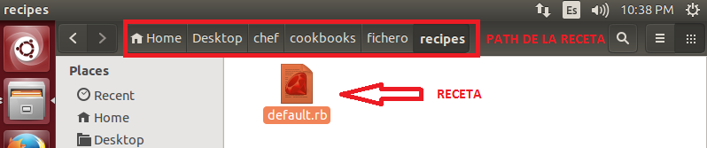

### EJERCICIO 2:

Después de haber entendido los mini-manuales que se nos facilita en los apuntes, para realizar la receta lo primero que voy a hacer es crear el esqueleto de nuestro repositorio.

Para ello creamos un directorio dónde deseemos (en mi caso en el escritorio) con `mkdir Desktop/chef`, dentro de esta carpeta tendremos que crear 2 archivos y un directorio más:

1. "node.json", que es el que se encargara de decir que recetas vamos a ejecutar.

2. "solo.rb", que referencia el path de ambos.

3. Directorio "cookbooks" dónde tendremos las recetas que hallamos creado.

Lo primero a crear va a ser el archivo solo.rdb, que es el que se encarga de referenciar para ejecutar el chef correctamente, para ello creamos el archivo solo.rb con el siguiente contenido (notar que hay que poner los directorios dónde está tu repositorio):

    file_cache_path "/home/marquina/Desktop/chef"
    cookbook_path "/home/marquina/Desktop/chef/cookbooks"
    json_attribs "/home/marquina/Desktop/chef/node.json"

Ahora vamos a crear las recetas. Yo he elegido como editor nano, y un fichero con extensión .txt, además en la receta del fichero también se creará un directorio.

######Fichero:

Para crear nuestra receta que cree un fichero que usemos habitualmente, lo primero es crear su directorio dentro de nuestro cookbook para ello usamos el comando `mkdir -p /home/marquina/Desktop/chef/cookbooks/fichero/recipes`, y dentro de él creamos el fichero dafault.rb, que contiene:
	
    directory '/home/marquina/Desktop/fichero'
    file "/home/marquina/Desktop/fichero/ejercicio.txt" do
      owner "marquina"
      group "marquina"
      mode 00544
      action :create
      content "Ejercico 2, creación de fichero.txt"
    end
    
Quedando de la siguiente manera:

Podemos probar que efectivamente funciona si creamos el archivo  node.json y referenciamos en él la receta, quedando así:

	{
	"run_list": [ "recipe[fichero]" ]
	}
    
Ahora ya lo comprobamos con el comando `sudo chef-solo -c /home/marquina/Desktop/chef/solo.rb`, y vemos que efectivamente funciona:

###### nginx:

Al igual que antes creamos su directorio dentro de nuestro cookbook para ello usamos el comando `mkdir -p /home/marquina/Desktop/chef/cookbooks/nginx/recipes`, y dentro de él creamos el fichero dafault.rb, que contiene:

	package 'nginx'
    
Probamos que efectivamente funciona añadiéndole la referencia de la receta en el  archivo node.json :

   	{
       	 "run_list": [ "recipe[fichero]","recipe[nginx]" ]
   	}
    
Comprobamos con el comando `sudo chef-solo -c /home/marquina/Desktop/chef/solo.rb`, y vemos que efectivamente funciona:

Aparte, también comprobamos que efectivamente lo ha instalado correctamente con `sudo service nginx status` como se puede observar:

###### nano:

Al igual que antes creamos su directorio dentro de nuestro cookbook para ello usamos el comando `mkdir -p /home/marquina/Desktop/chef/cookbooks/nano/recipes`, y dentro de él creamos el fichero dafault.rb, que contiene:

		package 'nano'
        

Probamos nuevamente que efectivamente funciona añadiéndole la referencia de la receta en el  archivo node.json :

   	{
       	 "run_list": [ "recipe[fichero]","recipe[nginx]","recipe[nano]" ]
   	}
    
Comprobamos con el comando `sudo chef-solo -c /home/marquina/Desktop/chef/solo.rb`, y vemos que efectivamente funciona también (aunque como ya estaba actualizado o instalado, no tendremos ningún recurso actualizado al finalizar chef, de ahí el 0/4):

