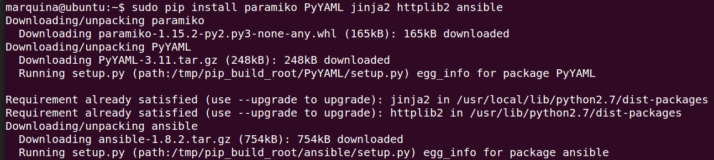
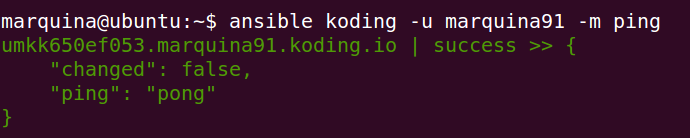
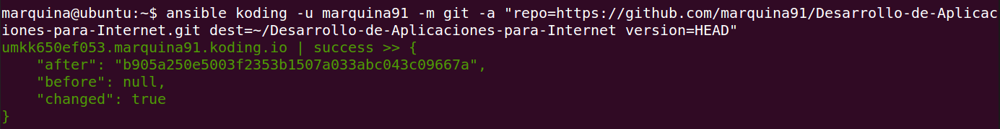
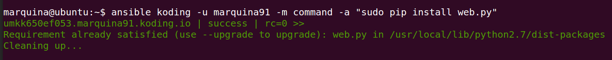
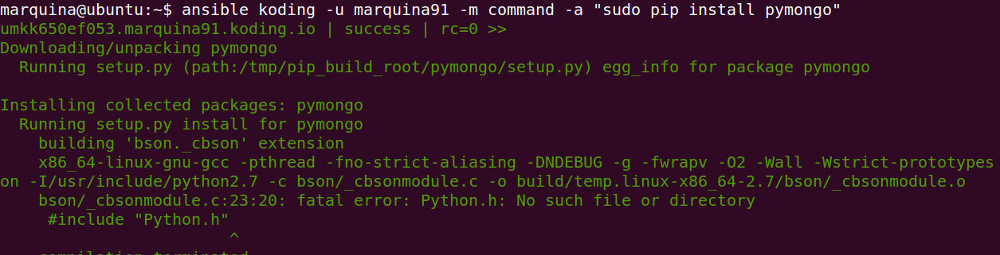
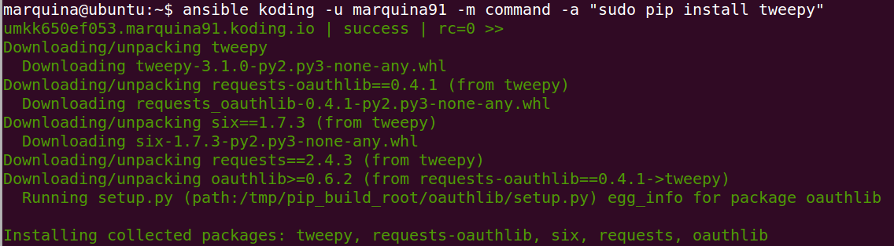
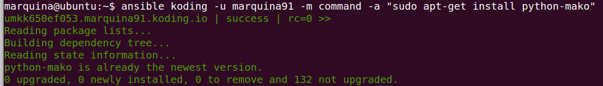
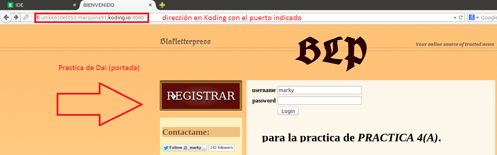

### EJERCICIO  4 :

Lo primero que necesitamos es tener instalado ansible, para ello usaremos la utilidad de instalación de módulos pip (si no lo tenemos instalado deberemos instalarlo con `sudo apt-get install python-pip`) con el comando `sudo pip install paramiko PyYAML jinja2 httplib2 ansible`(como se nos explica en los apuntes):

Creamos fichero inventario y añadimos nuestra máquina al control de ansible con el comando `echo -e "[koding] \n umkk650ef053.marquina91.koding.io" > ~/ansible_hosts` y le decimos a Ansible donde está la variable de entorno con `export ANSIBLE_HOSTS=~/ansible_hosts` :

Y comprobamos que funciona con el comando ` ansible koding -u marquina91 -m ping` (notar que he puesto koding, que es el grupo sobre el que quiero ejecutar las instrucciones, en mi caso solo una, la que acabamos de crear arriba):

Ahora que ya sabemos que funciona despliego mi repositorio de DAI mediante el comando: `ansible koding -u marquina91 -m git -a "repo=https://github.com/marquina91/Desarrollo-de-Aplicaciones-para-Internet.git dest=~/Desarrollo-de-Aplicaciones-para-Internet version=HEAD"`:

Ahora instalamos el Framework que he usado en las prácticas de DAI(web.py), para que se puedan ejecutar correctamente para ello ejecuto: `ansible koding -u marquina91 -m command -a "sudo pip install web.py"`:

Y los módulos usados:

1. La base de datos, con el comando `ansible koding -u marquina91 -m command -a "sudo pip install pymongo"` .

 
2. El módulo tweepy con el comando `ansible koding -u marquina91 -m command -a "sudo pip install tweepy"`:

 

3. La librería Mako con `ansible koding -u marquina91 -m command -a "sudo apt-get install python-mako"` (en mi caso ya estaban instalado porque lo había instalado antes para probar una cosa, como se puede comprobar):

 
 
Y ya podemos arrancar la aplicación con `ansible koding -u marquina91 -m command -a "python /home/marquina91/Desarrollo-de-Aplicaciones-para-Internet/dai.py "`, y comprobamos que efectivamente está funcionando:

 