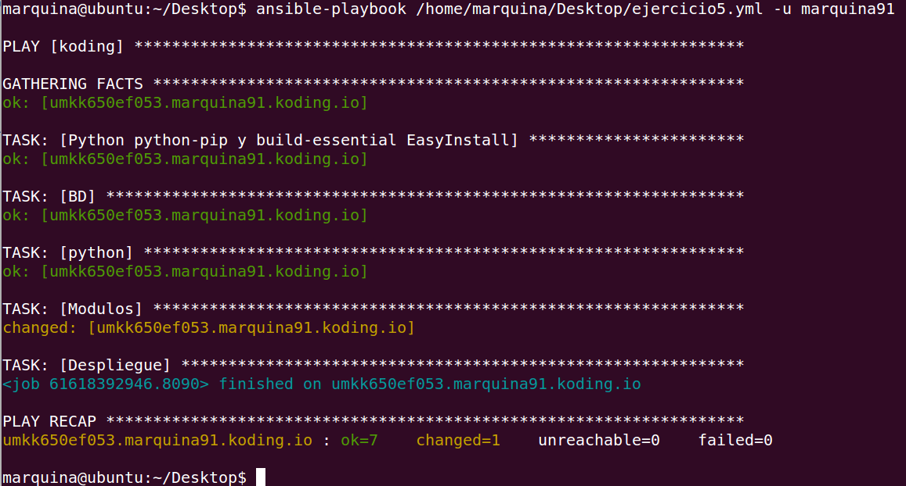
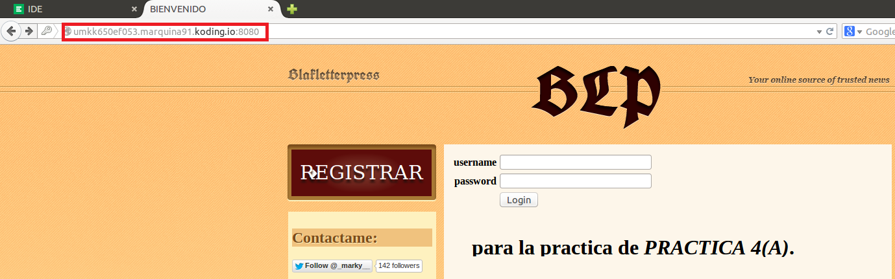

### EJERCICIO 5 :

Para realizar el ejercicio creamos el archivo ejercicio5.yml con el siguiente contenido:
    ---
    - hosts: koding
      sudo: yes
      tasks:
        - name: Python python-pip y build-essential EasyInstall
          apt: name=build-essential state=present
          apt: name=python-dev state=present
          apt: name=python-setuptools state=present
          apt: name=python-pip state=present
        - name: BD
          apt: name=mongodb-server state=present
        - name: python
          apt: name=python3-dev state=present
        - name: Modulos
          command: pip install web.py mako tweepy pymongo
        - name: Despliegue
          command: chdir=/home/marquina91/Desarrollo-de-Aplicaciones-para-Internet/ 
                   python dai.py 8080 &
          async: 50
          poll: 0

Y ejecutamos el script con el comando `ansible-playbook /home/marquina/Desktop/ejercicio5.yml -u marquina91`(notar que he puesto la ruta dónde he creado mi script):

Por último comprobamos que funciona:

