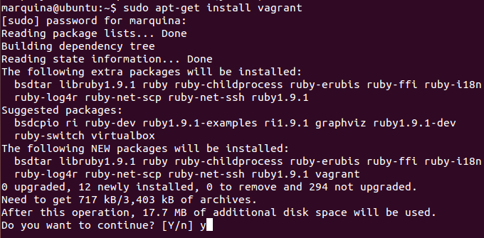
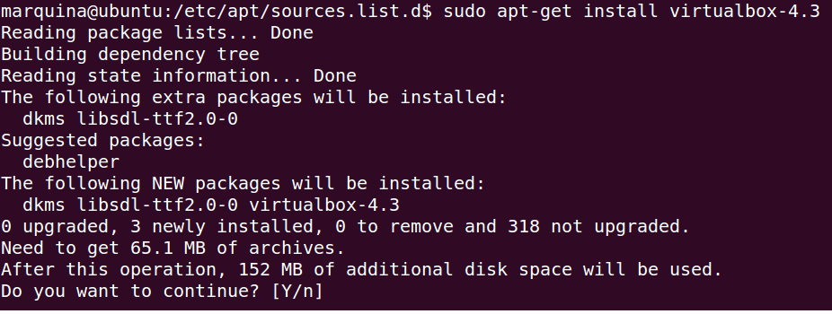
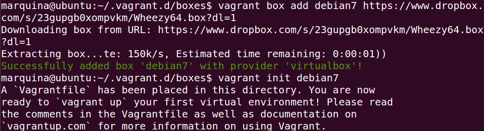
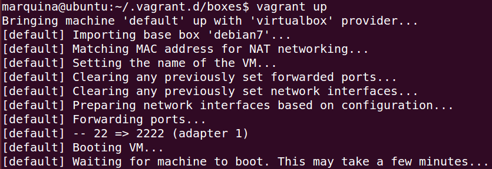
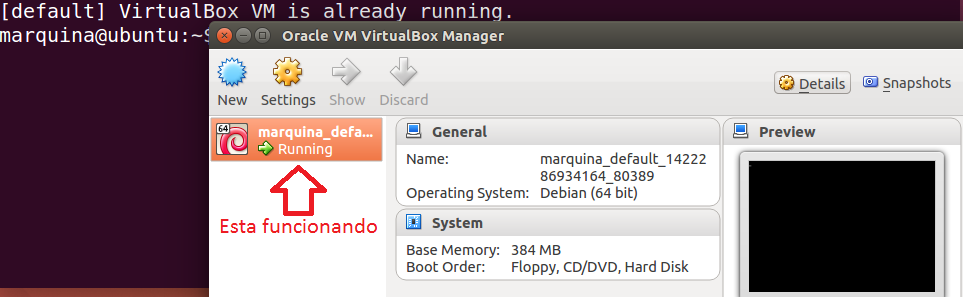

### EJERCICIO 6 :

Para realizar el ejercicio lo primero voy a instalar vargrant, para ello usamos el comando `sudo apt-get install vagrant`:

También necesitaremos tener instalado VitualBox, para ello seguimos los siguientes pasos:
1. Creamos un archivo de texto en el directorio dónde se añaden los repositorios con`sudo gedit /etc/apt/sources.list.d/virtualbox.list`, y añadimos `deb http://download.virtualbox.org/virtualbox/debian raring contrib` al archivo y lo guardamos.

2. Añadimos la llave pública con `wget -q http://download.virtualbox.org/virtualbox/debian/oracle_vbox.asc -O- | sudo apt-key add -`

3. Y actualizamos los repositorios con `sudo apt-get update`

4. Ya podemos instalarlo con el comando `sudo apt-get install virtualbox-4.3 `:
 
	

Descargamos una máquina configurada con el comando `vagrant box add debian7 https://www.dropbox.com/s/23gupgb0xompvkm/Wheezy64.box?dl=1` (en mi caso Debian 7.0 ):

Luego ejecutamos el comando `Vagrant init debian7`(como se puede observar en la captura de arriba), que nos creara el Vagrantfile en la raíz de nuestro proyecto.

Y ahora para arrancar la máquina ejecutamos `vagrant up`, es importante tener antes funcionando VirtualBox o nos puede dar errores al importar nuestra box:

Cuando acabemos ya estará la imagen que nos hemos descargado antes funcionando en nuestro VirtualBox:

Ya para acceder solo nos queda ejecutar el comando `vagrant ssh`, y estaremos dentro.
