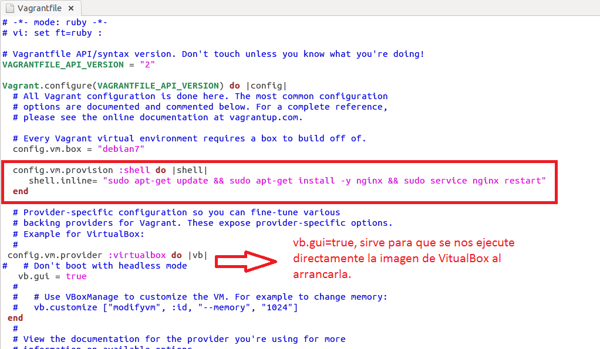
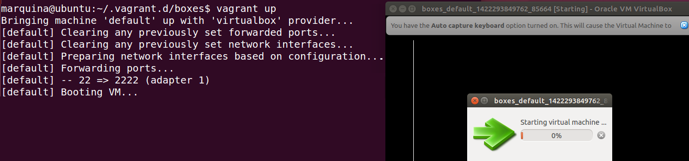

### EJERCICIO 7:

Para realizar este ejercicio, seguimos los apuntes y nos vamos al Vagrantfile que creamos en el ejercicio anterior con `Vagrant init Debian7` (en mí caso está en .vagrant.d/boxes, ya que lo hice en la raíz del proyecto dónde me había descargado la imagen), lo editamos añadiéndole lo siguiente:

        config.vm.provision :shell do |shell|
          shell.inline= "sudo apt-get update && sudo apt-get install -y nginx &&         sudo service nginx restart"
	    end

Quedándonos de la siguiente manera:

Ahora ya solo tenemos que ejecutar `Vagrant up`, y se ejecutará nuestra imagen con nginx instalado:

