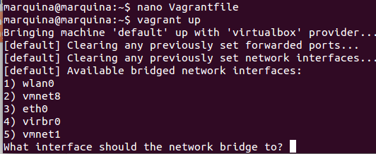
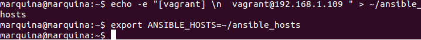

### EJERCICIO  8 :

Para este ejercicio he creado una nueva máquina virtual con una versión más moderna que la que use en los anteriores, en concreto [Debian 7.7.0](https://github.com/kraksoft/vagrant-box-debian/releases/download/7.7.0/debian-7.7.0-amd64.box).

Para crearla seguimos los pasos del ejercicio 6 :

 - `vagrant box add debian7-7 https://github.com/kraksoft/vagrant-box-debian/releases/download/7.7.0/debian-7.7.0-amd64.box`
 - `Vagrant init debian7-7`
 - `vagrant up`

Ahora vamos a necesitar saber la IP de nuestra máquina virtual para asignarle a esta un grupo, como vimos en el ejercicio 4 (que realice con koding).

Por tanto accedemos a la máquina virtual con `vagrant ssh` y seguidamente obtenemos su IP con `/sbin/ifconfig -a`:

Podemos observar que no nos da bien la IP por lo tanto configuramos el Vagrantfile quitándole el comentario(#) a la siguiente línea dentro de  Vagrant.configure("2") do |config|:

Volvemos a montar la máquina con `vagrant up` y se nos preguntará que interfaz queremos, elegimos wlan0 que es la que nos interesa (poniendo un 1):

Volvemos a entrar ahora en la máquina virtual (`vagrant ssh`), y vemos que ahora si obtenemos la IP que necesitábamos con `/sbin/ifconfig -a`:

Ahora que ya sabemos la IP para acceder mediante ssh a vagrant, deberemos cambiarle la contraseña ya que aunque no la piden con `vagrant ssh`, ansible si la va a necesitar a la hora de conectar por ssh, por lo tanto la cambiamos con `passwd vagrant`.

Ahora añadimos la IP y usuario a nuestro inventario :

- `echo -e "[vagrant] \n  vagrant@192.168.1.109" > ~/ansible_hosts`

- `export ANSIBLE_HOSTS=~/ansible_hosts`

Ya solo queda crear el playbook con `sudo nano ejercicio8.yml` con el siguiente contenido (como en el ejercicio 5):

Lo ejecutamos con `ansible-playbook ejercicio8.yml`, y comprobamos que funciona correctamente ejecutando en un navegador la IP de nuestra máquina virtual:

