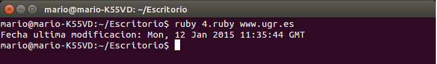

###Ejercicio4 - Crear una serie de funciones instanciadas con un URL que devuelvan algún tipo de información sobre el mismo: fecha de última modificación, por ejemplo. Pista: esa información está en la cabecera HTTP que devuelve.

<pre>
#!/usr/bin/ruby

require 'net/http'

def fecha(url)
informacion = Net::HTTP.get_response  url, '/'
puts("Fecha ultima modificacion: #{informacion['date'].to_s}\n")

end

url = ARGV[0]

fecha(url)
</pre>

Pasándole como argumento una web, en este caso www.ugr.es, nos muestra la fecha de la última modificación.

 
