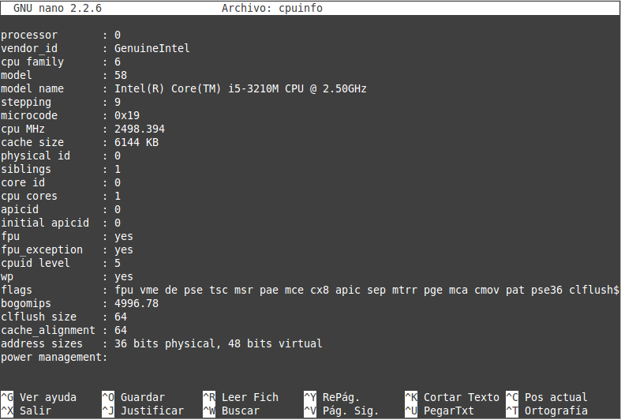

###Ejercicio10

**Comprobar si el procesador o procesadores instalados tienen estos flags. ¿Qué modelo de procesador es? ¿Qué aparece como salida de esa orden?**

Mediante el comando expuseto en la explicación del ejercicio egrep '^flags.*(vmx|svm)' /proc/cpuinfo no he obtenido ningun resultado, suponiendo que no disponemos en nuestro sistema de estos dos flags.

He accedido al fichero cpuinfo y he comprobado que **no existen esos dos flags**.

En la siguiente imagen podemos ver nuestro **modelo de CPU** y algunos de los flags disponibles.

