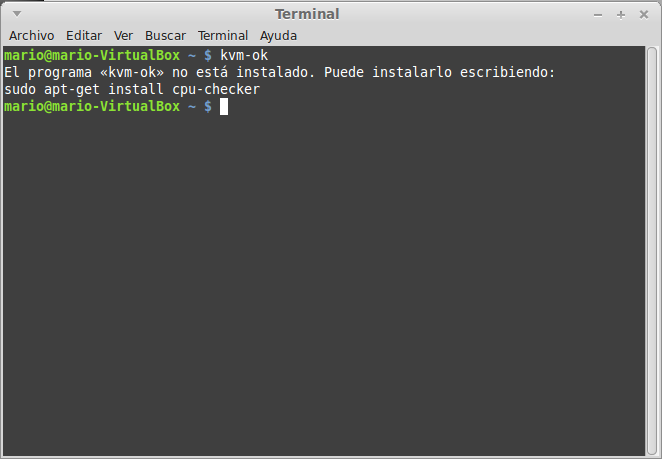
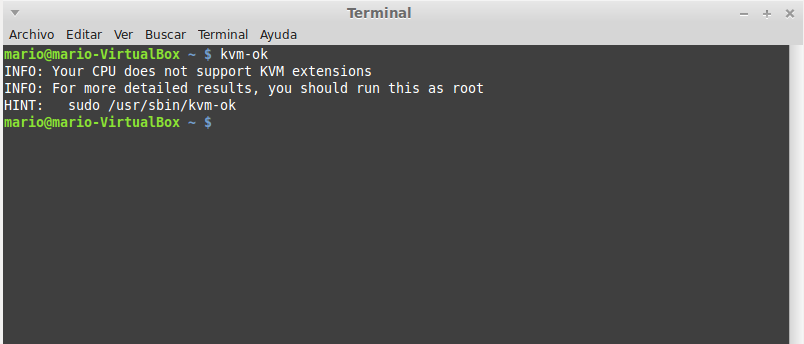

###Ejercicio11

**Comprobar si el núcleo instalado en tu ordenador contiene este módulo del kernel usando la orden kvm-ok.**

He comprobado si mi sistema operativo (Linux Mint 17) contiene el modulo kvm-ok, y en primer luegar me indicó que **instalara un paquete**.

Una vez instalado, al ejecutar kvm-ok, podemos ver que mi sistema operativo **no soporta este módulo ni extensiones KVM**.

