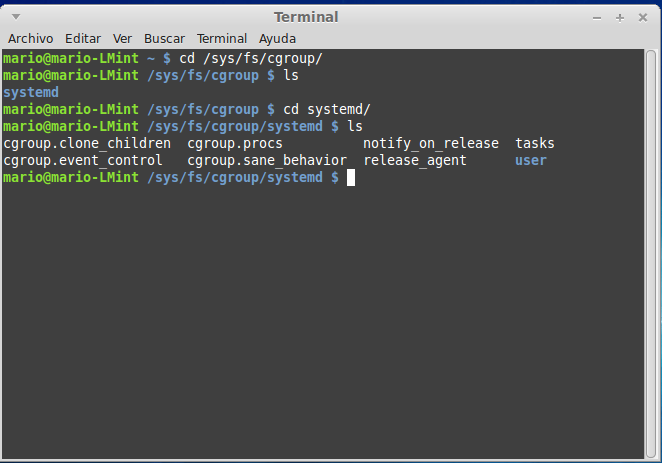

###Ejercicio7

**Comprobar si en la instalación hecha se ha instalado cgroups y en qué punto está montado, así como qué contiene.**

Comprobación realizada sobre un sistema operativo Linux Mint 17.
Cgroup se monta por defecto y está en /sys/fs/cgroup. En la siguiente imagen podemos comprobarlo.

