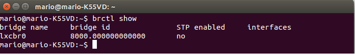

###Ejercicio 2

**1. Mostrar los puentes configurados en el sistema operativo.**

**2. Crear un interfaz virtual y asignarlo al interfaz de la tarjeta wifi, si se tiene, o del fijo, si no se tiene.**

Si queremos **mostrar los puentes de red** configurados en nuestro sistema operativo podemos hacerlo mediante el siguiente comando:

<pre>brctl show</pre>

Mostramos una imagen a continuación:

Ahora **creamos una interfaz virtual** siguiendo los pasos que nos describe el documento de este tema. Podemos **comprobar que se ha creado** la nueva interfaz de red virtual ejecutando:

<pre>
sudo brctl addbr intvirtual
ip addr show
</pre>
