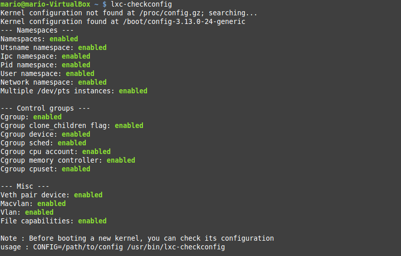

###Ejercicio1
**Instala LXC en tu versión de Linux favorita. Normalmente la versión en desarrollo, disponible tanto en GitHub como en el sitio web está bastante más avanzada; para evitar problemas sobre todo con las herramientas que vamos a ver más adelante, conviene que te instales la última versión y si es posible una igual o mayor a la 1.0.**

Instalamos LXC en una distibución Ubuntu 14.04 mediante el comando:

<pre> sudo apt-get install lxc </pre>

Comprobamos que se ha instalado correctamente y todos los parámetros están habilitados.

