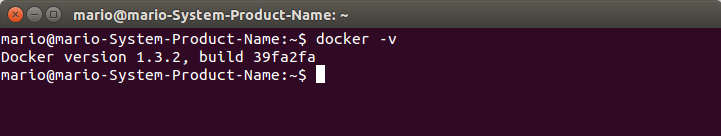

###Ejercicio10

**Instalar docker.**

Para instalar Docker en Ubuntu, en este caso en 14.04LTS vamos a seguir los siguientes pasos:

En primer lugar, debemos actualizar el kernel con la siguiente orden:

<pre>sudo apt-get install linux-image-generic-lts-raring linux-headers-generic-lts-raring </pre>

Reiniciamos el sistema para que tome los cambios:

<pre>sudo reboot</pre>

Comprobamos que está actualizado en la última versión con:

<pre>uname -a</pre>

Ahora agregamos el repositorio Docker:

<pre>sudo sh -c "echo deb https://get.docker.io/ubuntu docker main > /etc/apt/sources.list.d/docker.list"</pre>

Actualizamos la lista de fuentes:

<pre>sudo apt-get update</pre>

Instalamos el paquete Docker:

<pre>sudo apt-get install lxc-docker</pre>

Verificamos que ha sido instalado:

<pre>docker -v</pre>

