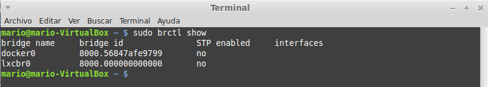

###Ejercicio2
**Comprobar qué interfaces puente se han creado y explicarlos.**

Podemos comprobar las interfaces puente mediante el siguiente comando:

<pre>sudo brctl show</pre>

Aqui tenemos una captura de la salida, donde podemos ver que tenemos dos interfaces, una para Docker, instalado anteriormente y otra para lxc, instalado para el ejercicio anterior.

