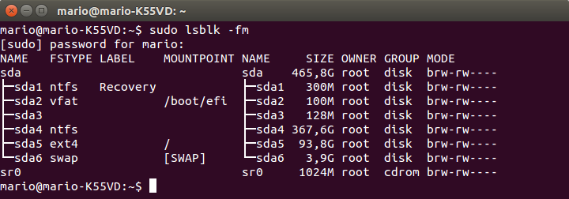

###Ejercicio1

**¿Cómo tienes instalado tu disco duro? ¿Usas particiones? ¿Volúmenes lógicos?**

Mediante la ejecución de la siguiente instrucción podemos ver la estructuración de mi disco duro.

<pre>sudo lsblk -fm</pre>

Donde **sda1** es una partición de recuperación del sistema, **sda2** y **sda3** están relacionadas con el arranque del sistema, **sda4** es una partición ntfs donde se encuentra instalado Windows 8, **sda5** es una partición lógica donde reside Ubuntu con formato ext4 y **sda6** es la partición de intercambio (swap).

**Si tienes acceso en tu escuela o facultad a un ordenador común para las prácticas, ¿qué almacenamiento físico utiliza?**

En nuestra escuela, el sistema operativo se carga a través de una imagen, por tanto los datos almacenados en el una vez cerrada la sesión no se almacenan. Cada alumno posee una partición U donde puede almacenar sus ficheros de forma permanente.
