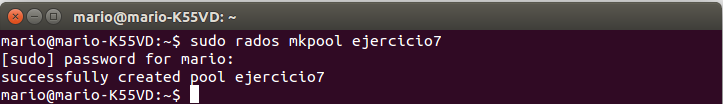
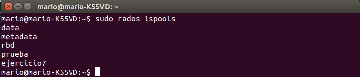

###Ejercicio7

**Almacenar objetos y ver la forma de almacenar directorios completos usando ceph y rados.**

Creamos un nuevo pool de esta forma:

Y lo listamos

Para almacenar un objeto en el pool creado utilizamos el siguiente comando:

<pre>sudo rados put -p ejercicio7 objeto ejemplo.img</pre>
