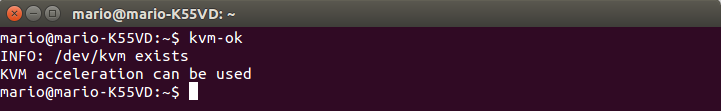

###Ejercicio1

**Instalar los paquetes necesarios para usar KVM.**

Para comprobar si nuestro sistema operativo esta preparado para usar KVM ejecutamos

<pre>kvm-ok</pre>

En mi caso he tenido previamente que instalar un paquete adicional con

<pre>sudo apt-get install cpu-checker</pre>

Finalmente quedo correcto

