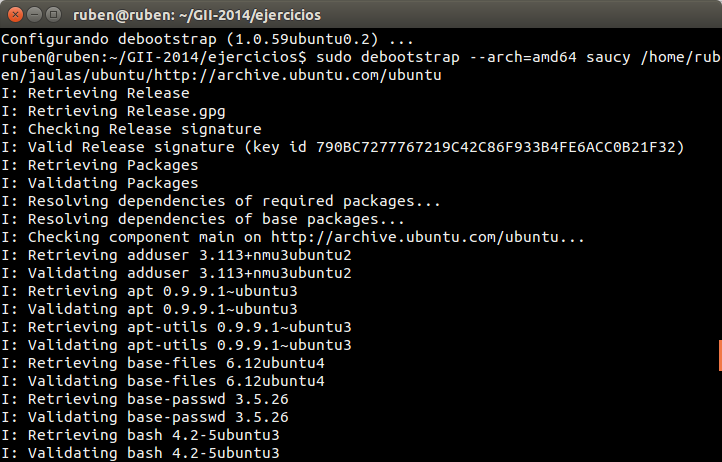
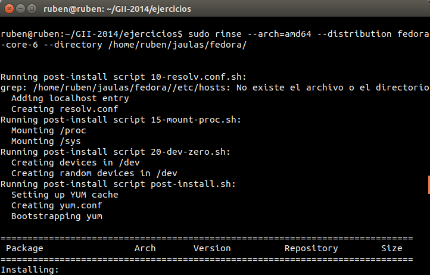
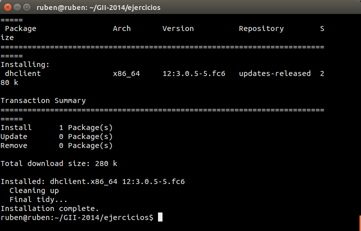

###Ejercicio3

**1. Usar debootstrap (o herramienta similar en otra distro) para crear un sistema mínimo que se pueda ejecutar más adelante.**

Siguiendo las instrucciones del temario creamos la jaula y el directorio donde instalar la maquina, en este caso Ubuntu.

<pre>sudo debootstrap --arch=amd64 saucy /home/ruben/jaulas/ubuntu/	http://archive.ubuntu.com/ubuntu</pre>

**2. Experimentar con la creación de un sistema Fedora dentro de Debian usando Rinse.**

Para este caso creamos un sistema Debian siguiendo las mismas instrucciones.

Instalamos Rinse y ejecutamos la instalación del sistema Fedora:

<pre>sudo rinse --arch=amd64 --distribution
    fedora-core-6 --directory /home/ruben/jaulas/fedora/</pre>

