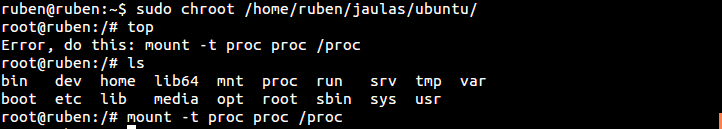
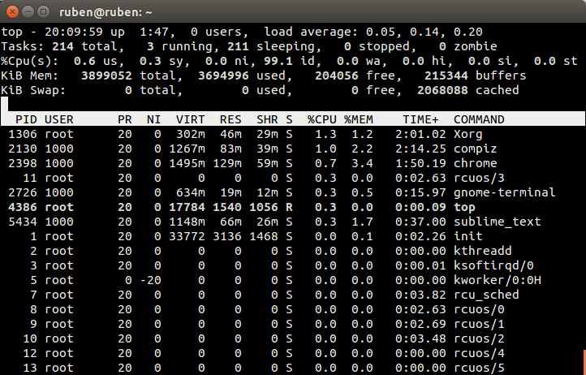

###Ejercicio4

**Instalar alguna sistema debianita y configurarlo para su uso. Trabajando desde terminal, probar a ejecutar alguna aplicación o instalar las herramientas necesarias para compilar una y ejecutarla.**

Para no instalar de nuevo ningun sistema utilizaremos el instalado en el ejercicio anterior.

Primero de todo entramos en la jaula:

<pre>sudo chroot /home/ruben/jaulas/ubuntu</pre>

Al ejercutar por ejemplo el comando **top** dara un error, lo arreglamos como no indica.

