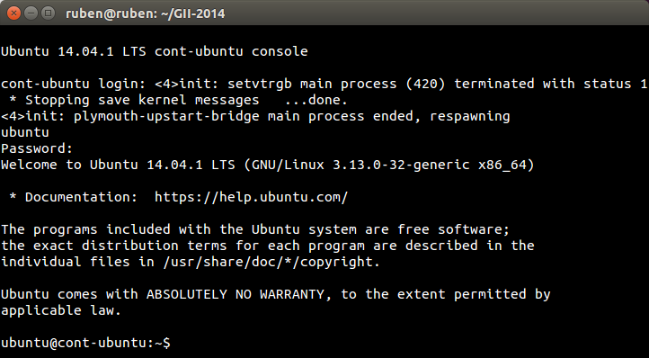

###Ejercicio3

**1.Crear y ejecutar un contenedor basado en Debian.**

Creamos el contenedor:

<pre>sudo lxc-create -t ubuntu -n cont-ubuntu</pre>

Y lo ejecutamos:

<pre>sudo lxc-start -n cont-ubuntu</pre>

**2.Crear y ejecutar un contenedor basado en otra distribución, tal como Fedora. Nota En general, crear un contenedor basado en tu distribución y otro basado en otra que no sea la tuya. Fedora, al parecer, tiene problemas si estás en Ubuntu 13.04 o superior, así que en tal caso usa cualquier otra distro.**

Creamos el contenedor:

<pre>sudo lxc-create -t gentoo -n cont-gentoo</pre>

Y lo ejecutamos:

<pre>sudo lxc-start -n cont-gentoo</pre>