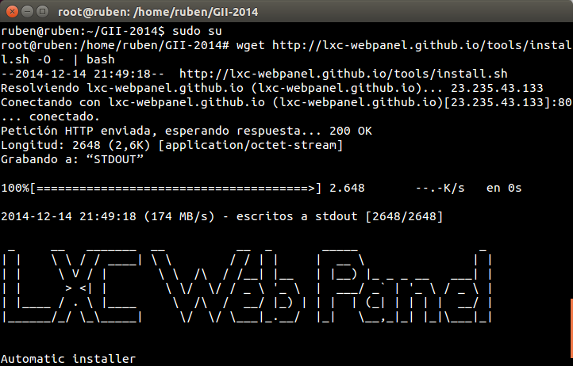
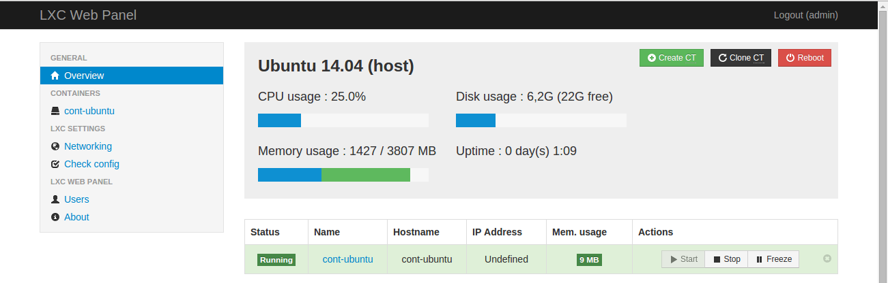
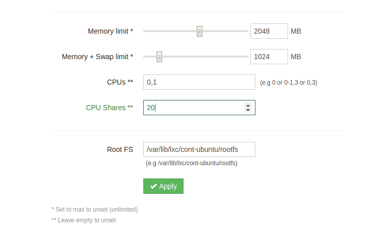

###Ejercicio4

**1. Instalar lxc-webpanel y usarlo para arrancar, parar y visualizar las máquinas virtuales que se tengan instaladas.**

Instalación (debes ser root):

<pre>sudo su
wget http://lxc-webpanel.github.io/tools/install.sh -O - | bash</pre>

Para conectarnos introducimos en el navegador la dirección Ip seguido de 5000. 

Una vez aparezca el login accedemos poniendo en usuario y contraseña **admin**.

 

 

A continuacion podemos observar el contenedor de ubuntu en ejecución.

 

**2. Desde el panel restringir los recursos que pueden usar: CPU shares, CPUs que se pueden usar (en sistemas multinúcleo) o cantidad de memoria.**

Para modificar los parametros accedemos al contenedor que queramos y los cambiamos.

 
