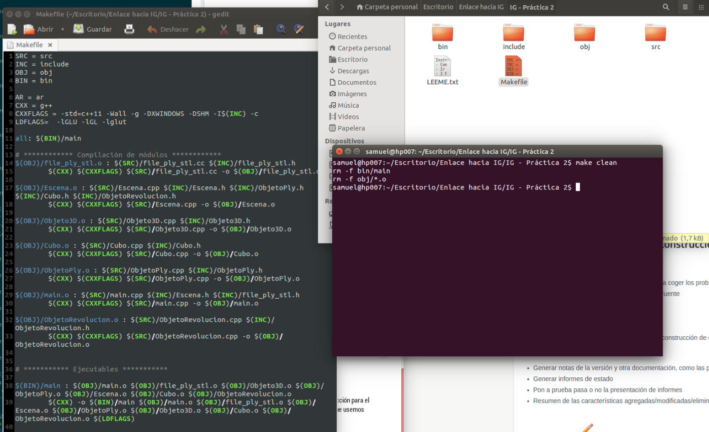
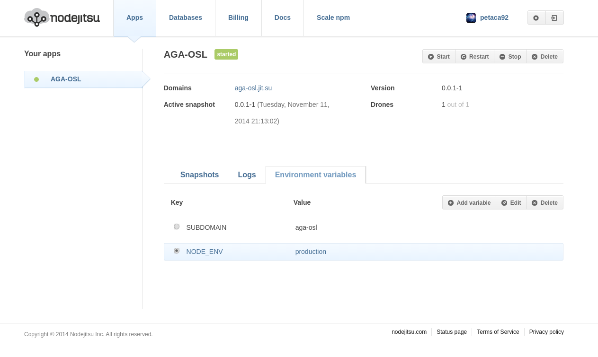

# Tema 2: Creando aplicaciones en la nube: Uso de PaaS y SaaS

### Ejercicio 1
Instalar un entorno virtual para tu lenguaje de programación favorito (uno de los mencionados arriba, obviamente).

==$ sudo apt-get install python-pip python-dev build-essential==

==$ sudo pip install --upgrade pip==

==$ sudo pip install --upgrade virtualenv==

### Ejercicio 2
Darse de alta en algún servicio PaaS tal como Heroku, Nodejitsu u OpenShift.

### Ejercicio 3
Crear una aplicación en OpenShift y dentro de ella instalar WordPress.

### Ejercicio 4
Crear un script para un documento Google y cambiarle el nombre con el que aparece en el menú, así como la función a la que llama.

### Ejercicio 5
Buscar un sistema de automatización de la construcción para el lenguaje de programación y entorno de desarrollo que usemos habitualmente.

[Artículo](http://centrodeartigo.com/articulos-educativos/article_11495.html)

### Ejercicio 6
Identificar, dentro del PaaS elegido o cualquier otro en el que se dé uno de alta, cuál es el fichero de automatización de construcción e indicar qué herramienta usa para la construcción y el proceso que sigue en la misma.

Nodejitsu

En nodejitsu podemos ver una variable de producción que permitirá arrancar node.js en modo producción automaticamente. Aquí un articulo de como se utiliza.

[Running Express.js in Production Mode](http://www.hacksparrow.com/running-express-js-in-production-mode.html)

### Ejercicio 7
Buscar un entorno de pruebas para el lenguaje de programación y entorno de desarrollo que usemos habitualmente.

Entorno de pruebas para .NET
[NUnit](http://www.nunit.org/)
[NUnit Wikipedia](http://es.wikipedia.org/wiki/NUnit)
[Nunit como utilizarlo](http://www.mundoprogramacion.com/colabora/puntoNET/giovannyf_NUnit.htm)

