# Tema 2: Creando aplicaciones en la nube: Uso de PaaS y SaaS

### Ejercicio 1
Instalar un entorno virtual para tu lenguaje de programación favorito (uno de los mencionados arriba, obviamente).

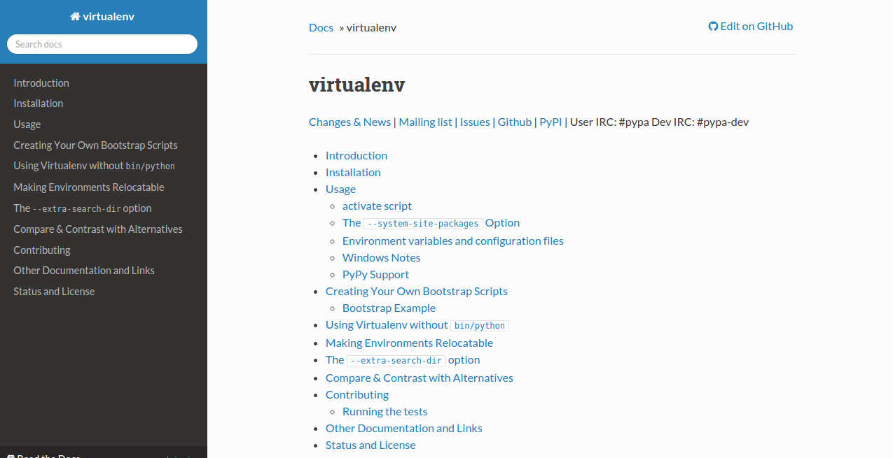

==$ sudo apt-get install python-pip python-dev build-essential==

==$ sudo pip install --upgrade pip==

==$ sudo pip install --upgrade virtualenv==

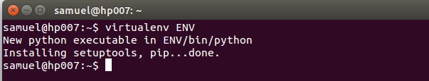

### Ejercicio 2
Darse de alta en algún servicio PaaS tal como Heroku, Nodejitsu u OpenShift.

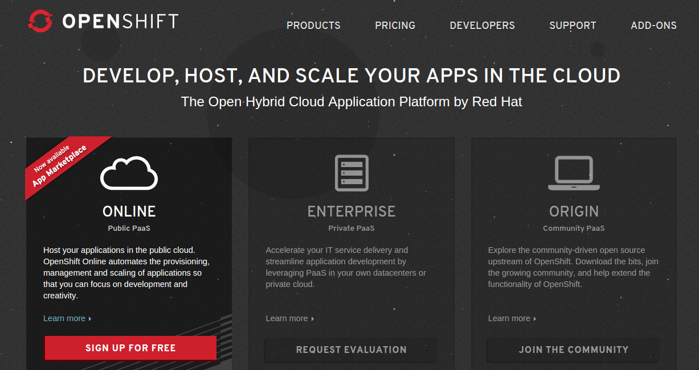

### Ejercicio 3
Crear una aplicación en OpenShift y dentro de ella instalar WordPress.

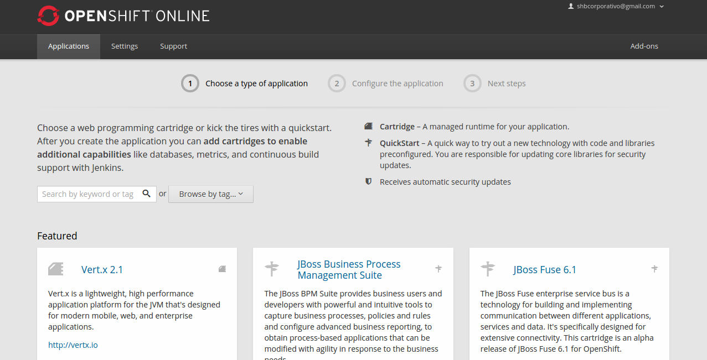

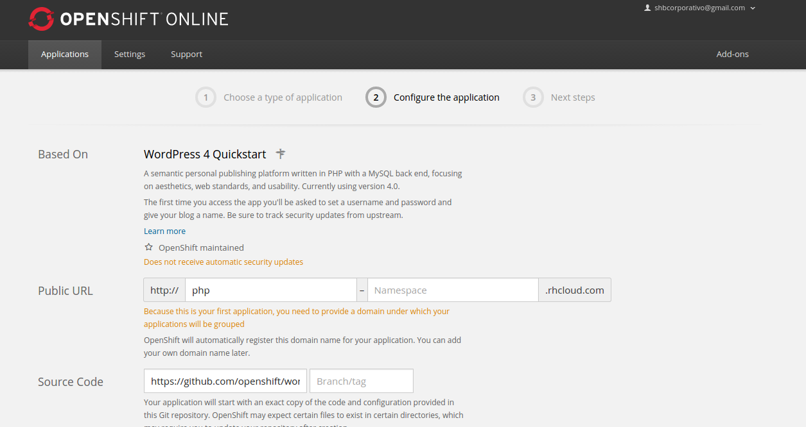

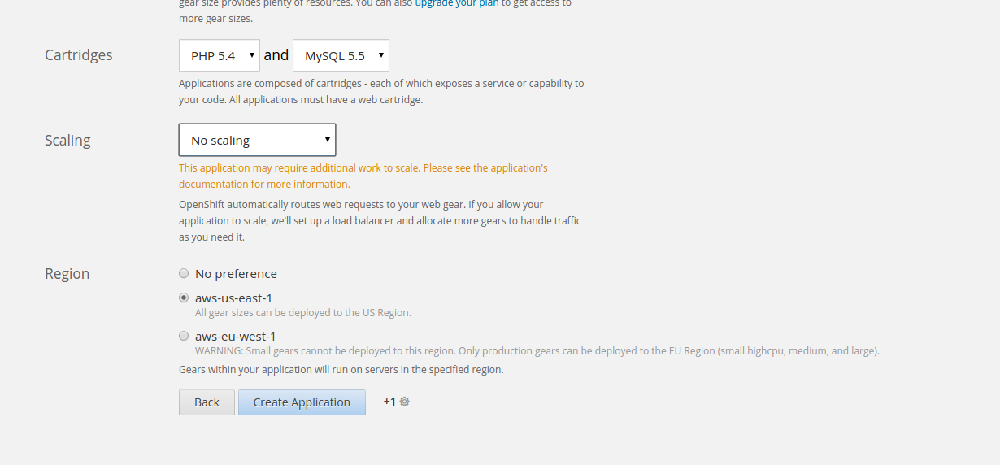

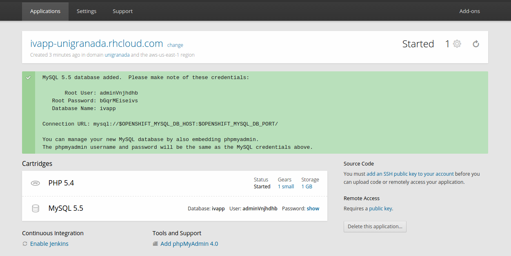

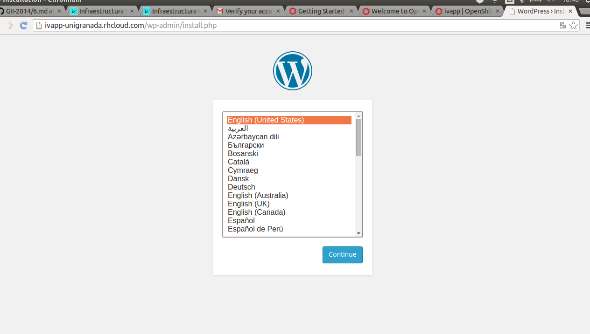

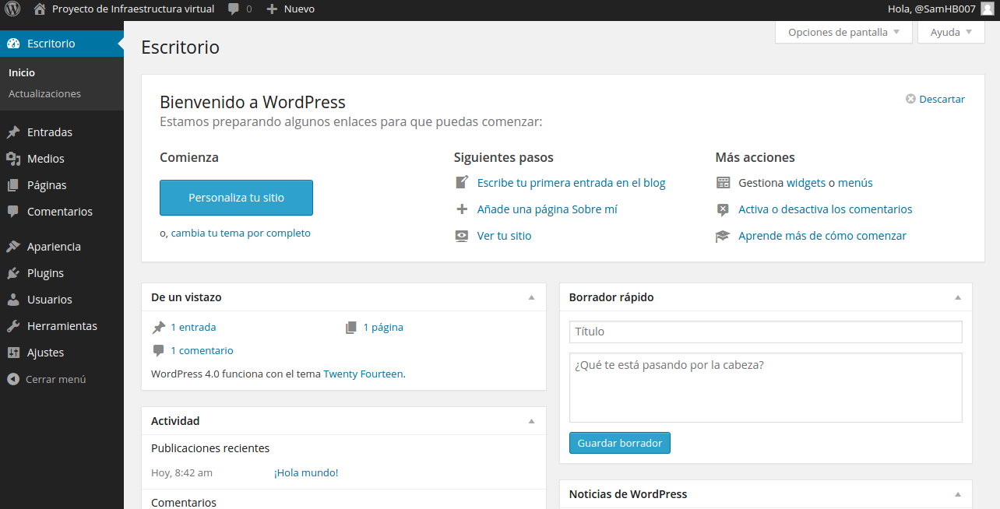

### Ejercicio 4
Crear un script para un documento Google y cambiarle el nombre con el que aparece en el menú, así como la función a la que llama.

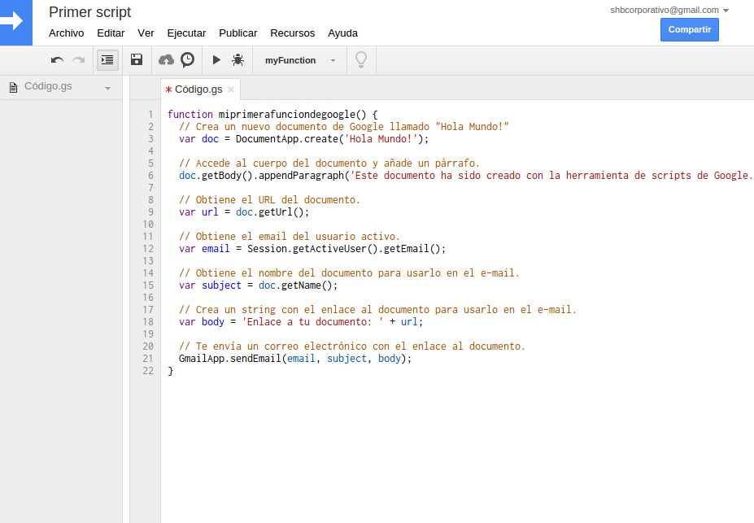

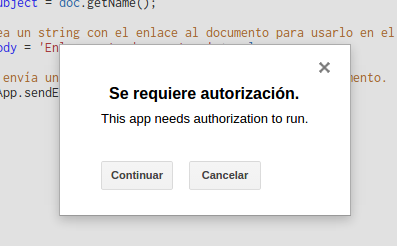

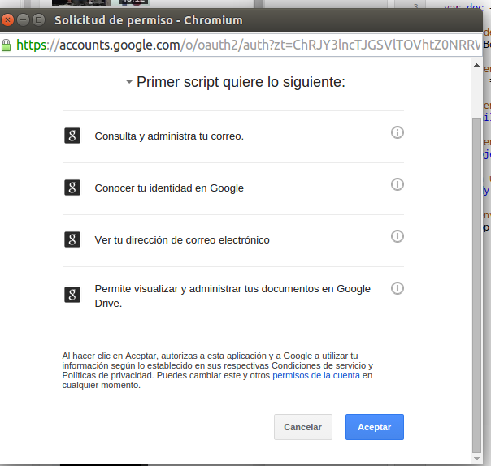

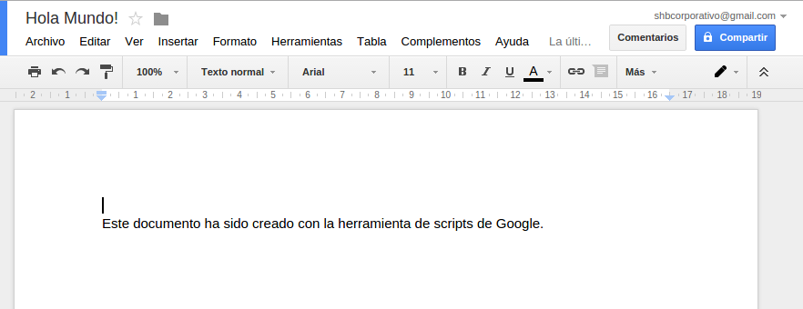

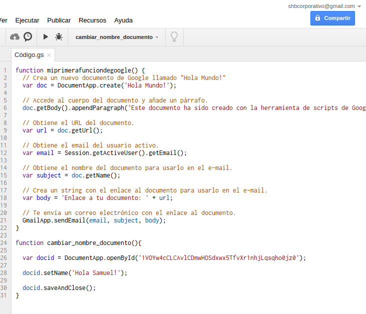

