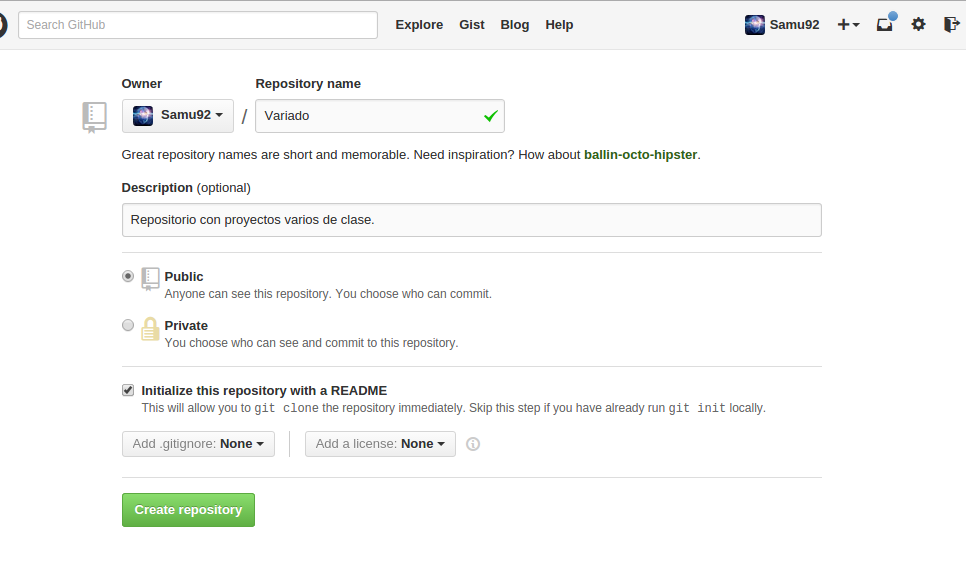
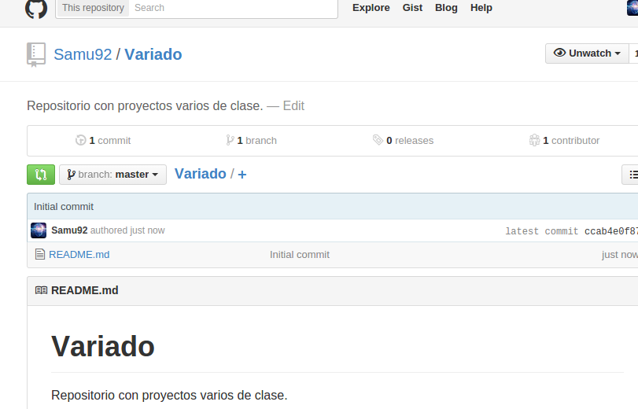
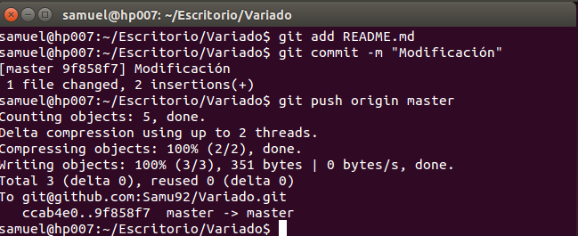

# Ejercicios de Samuel Hernández Ballesteros
## Introducción a la infraestructura virtual: concepto y soporte físico.
### Ejercicio 1
**Consultar en el catálogo de alguna tienda de informática el precio de un ordenador tipo servidor y calcular su coste de amortización a cuatro y siete años. Consultar [este artículo](http://http://www.infoautonomos.com/consultas-a-la-comunidad/988/) en Infoautónomos sobre el tema. **
_ _ _

Si compramos un servidor la ley establece que el porcentaje máximo que se puede aplicar como un gasto de amortización es de un 26% anual.

Esto quiere decir que si tu servidor valía 1000 euros, entonces ahora valdrá 740 euros, y de tal manera al año siguiente se puede deducir a otros 260 euros y así hasta que tu servidor valga cero euros.

Además, deberás tener presente la fecha de compra. Por ejemplo si compraste el servidor el 1 de abril deberás deducir un 26%, multiplicado (0,75) es decir:

    1000 euros x 26% = 260 euros anuales, como lo has tenido sólo 9 meses del año, multiplicando 260 x 0,75 = 195 euros deducibles de gasto de amortización.

Cabe indicar que siempre deberás informarte del porcentaje de amortización vigente.
### Ejercicio 2
**Usando las tablas de precios de servicios de alojamiento en Internet y de proveedores de servicios en la nube, Comparar el coste durante un año de un ordenador con un procesador estándar (escogerlo de forma que sea el mismo tipo de procesador en los dos vendedores) y con el resto de las características similares (tamaño de disco duro equivalente a transferencia de disco duro) si la infraestructura comprada se usa sólo el 1% o el 10% del tiempo.**
_ _ _

Empresa **[1&1](http://http://www.1and1.es)**

Servidor dedicado:
Núcleos de CPU: 2 x 8 Cores x 2,5 GHz
Memoria RAM: 32 GB DDR3 ECC
Disco duro: 3,000 GB (3 x 1,500 SATA)
RAID: Hardware RAID 5

Precio 149,99€ / Mes

vCPU (Cores)8 0,08€/hora
Memoria RAM 31 GB 0,31€/hora
Espacio de almacenamiento 800 GB 0,08€/hora
Sistema OperativoLinux0€/hora
0,47€/hora

338,40 € al mes* (Dependiendo del consumo)

Servidor dedicado: 149,99 € * 12 = 1799.88 € 

Servidor Cloud
- Uso del 1%: 338,40€ * 12 * 0,01 = 40.608€
- Uso del 10%: 338,40 * 12 * 0,10 = 406.08€

### Ejercicio 3
1.¿Qué tipo de virtualización usarías en cada caso? Comentar en el foro.

¿Qué tipo de virtualización es la más adecuada para: alojar varios clientes en un sólo servidor, crear un sistema eficiente de web + middleware + base de datos, un sistema de prueba de software e integración continua? Responder aquí y razonar.
Respuesta:

Para alojar varios clientes en un sólo servidor en mi opinión la opción más adecuada es una virtualización a nivel de sistema operativo que permite que anfitrión y cliente usen el mismo sistema operativo pero con invitados aislados del anfitrión y entre sí.

Para crear un sistema eficiente de web + middleware + base de datos optaría por una virtualización plena ya que visualiza todos los aspectos de un ordenador permitiéndonos tener un sistema eficiente y completo.

Para el sistema de prueba de software e integración continua no estoy muy seguro de que virtualización se aplicaría. El proceso de este sistema según he leído suele ser que cada cierto tiempo (horas) descarga las fuentes del software desde el control de versiones (por ejemplo CVS, Git, Subversion, Mercurial o Microsoft Visual SourceSafe) lo compila, ejecuta pruebas y genera informes. 

Respuesta de un compañero:

Para alojar varios clientes en un servidor, utilizaría la virtualización plena o a nivel de sistema operativo, para poder aislar las cuentas de cada usuario.

Para crear un sistema eficiente de web + middleware + base de datos utilizaría la virtualización de aplicaciones para aislarlas del resto del SO.

Y para un sistema de prueba de software e integración continua utilizaría la virtualización de entornos de desarrollo para reproducir entornos de producción de la forma más fiel posible.

2.Crear un programa simple en cualquier lenguaje interpretado para Linux, empaquetarlo con CDE y probarlo en diferentes distribuciones.

### Ejercicio 4
Hacer el [tutorial de línea de órdenes de docker](http://https://www.docker.com/tryit/) para comprender cómo funciona.
Avanzado Instalarlo y crear una aplicación contenedorizada

### Ejercicio 5
Instala el sistema de gestión de fuentes git

==$ sudo apt-get install git==

[Introducción al uso de GIT](http://www.youtube.com/watch?v=ygbWIJWe29Y) He seguido este tutorial y configurado git en mi máquina Linux.

Restricción y medición de recursos: cgroups #

Este [vídeo de RedHat](http://www.youtube.com/watch?v=KX5QV4LId_c) explica cómo y en qué ocasiones se debe usar cgroups para gestionar los recursos de un servidor.
### Ejercicio 6
1. Crear un proyecto y descargárselo con git. Al crearlo se marca la opción de incluir el fichero README.

samuel@hp007:~/Escritorio$ git clone git@github.com:Samu92/Variado.git

Clonar en «Variado»...
remote: Counting objects: 3, done.

remote: Compressing objects: 100% (2/2), done.

remote: Total 3 (delta 0), reused 0 (delta 0)

Receiving objects: 100% (3/3), done.

Checking connectivity... hecho.

samuel@hp007:~/Escritorio$ ls

AddTrustExternalCARoot.crt  Dropbox   Repositorio creado.png  Variado

Creando nuevo proyecto.png  GII-2014  Ubuntu

samuel@hp007:~/Escritorio$ cd Variado/

samuel@hp007:~/Escritorio/Variado$ ls

README.md

samuel@hp007:~/Escritorio/Variado$ 

2. Modificar el readme y subir el fichero modificado.

### Ejercicio 7
1. Crear diferentes grupos de control sobre un sistema operativo Linux. Ejecutar en uno de ellos el navegador, en otro un procesador de textos y en uno último cualquier otro proceso. Comparar el uso de recursos de unos y otros durante un tiempo determinado.

2. Calcular el coste real de uso de recursos de un ordenador teniendo en cuenta sus costes de amortización. Añadir los costes eléctricos correspondientes.
### Ejercicio 8
### Ejercicio 9