# Tema 3: Técnicas de virtualización

##Ejercicio 1
Crear un espacio de nombres y montar en él una imagen ISO de un CD de forma que no se pueda leer más que desde él. Pista: en ServerFault nos explican como hacerlo, usando el dispositivo loopback.

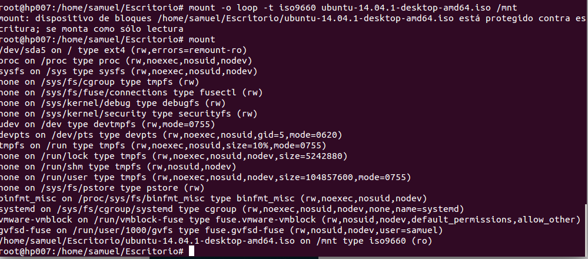

##Ejercicio 2
Mostrar los puentes configurados en el sistema operativo.

Crear un interfaz virtual y asignarlo al interfaz de la tarjeta wifi, si se tiene, o del fijo, si no se tiene.

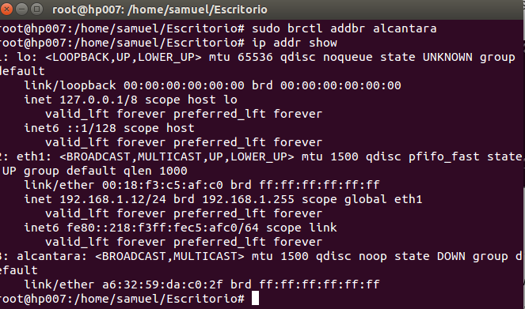

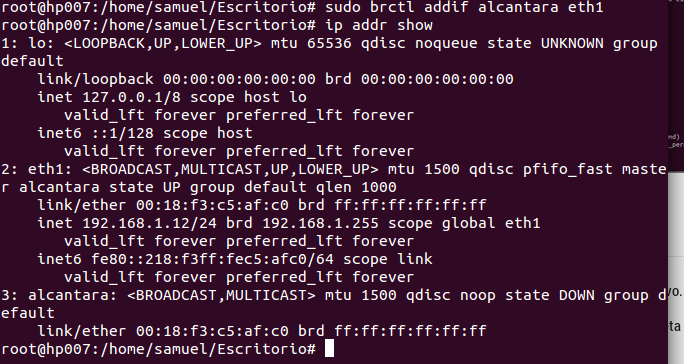

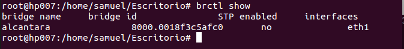

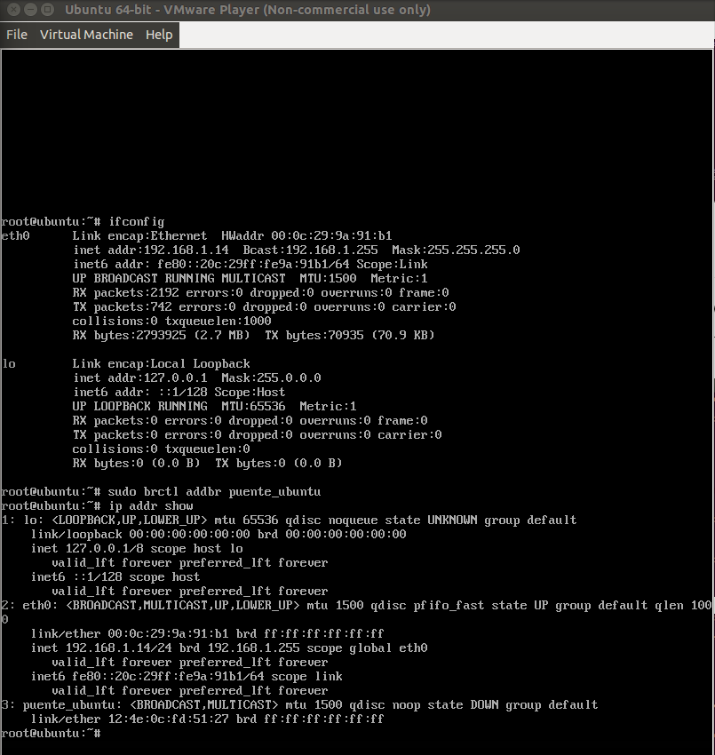

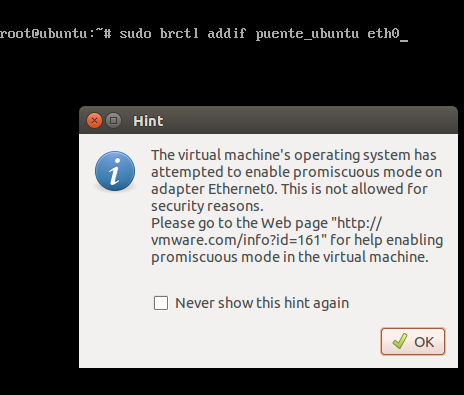

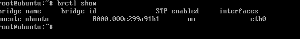

##Ejercicio 3
Usar debootstrap (o herramienta similar en otra distro) para crear un sistema mínimo que se pueda ejecutar más adelante.

Experimentar con la creación de un sistema Fedora dentro de Debian usando Rinse.

Instalamos rinse con:
   == sudo apt-get install rinse==

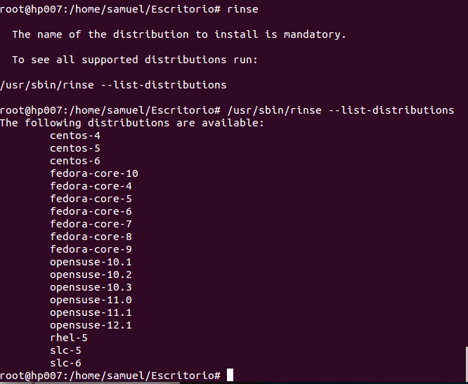

Instalamos alguna versión con la orden
**sudo rinse --arch=amd64 --distribution fedora-core-10 --directory /home/jaulas/fedora64**

##Ejercicio 4
Instalar alguna sistema debianita y configurarlo para su uso. Trabajando desde terminal, probar a ejecutar alguna aplicación o instalar las herramientas necesarias para compilar una y ejecutarla.

Entramos en la jaula anteriormente creada con chroot

Montamos el file system

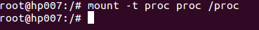

Instalamos aplicaciones y language pack

==apt-get install language-pack-es==

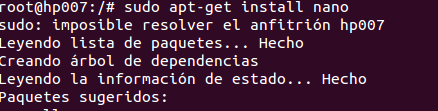

Creamos una aplicación simple

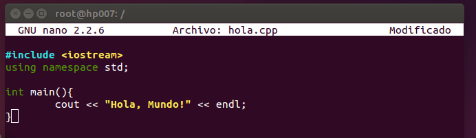

Ejecutamos

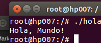

##Ejercicio 5
Instalar una jaula chroot para ejecutar el servidor web de altas prestaciones nginx.

Utilizamos la jaula anterior

Añadimos los repositorios de nginx en el directorio /etc/apt.

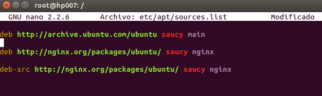

Obtenemos la key del repositorio de nginx

==root@hp007:/# apt-get install wget==

==wget http://nginx.org/keys/nginx_signing.key==

==apt-key add nginx_signing.key==

Actualizamos e instalamos nginx

==apt-get update==

==apt-get install nginx==

Iniciamos el servidor

==service nginx start==

Instalamos curl y comprobamos el localhost
==curl localhost==

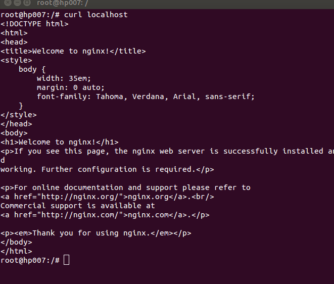

##Ejercicio 6
Crear una jaula y enjaular un usuario usando `jailkit`, que previamente se habrá tenido que instalar.

Descargamos e instalamos jailkit

==wget http://olivier.sessink.nl/jailkit/jailkit-2.17.tar.gz
==

==tar -xzvf jailkit-2.17.tar.gz==

==cd jailkit-2.17==

==./configure && make && sudo make install==

Utilizamos la jaula anterior

Creamos un nuevo usuario
==sudo adduser usuario_prueba==

Lo enjaulamos
==sudo jk_jailuser -m -j /home/jaulas/prueba32 usuario_prueba==

