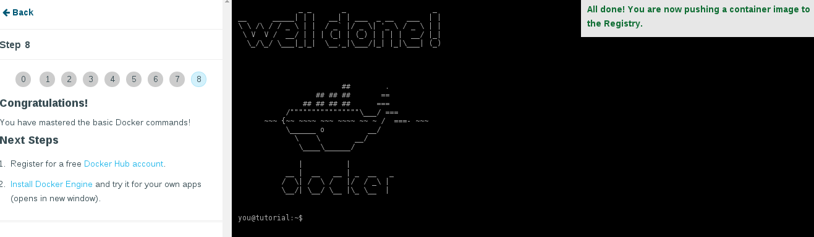
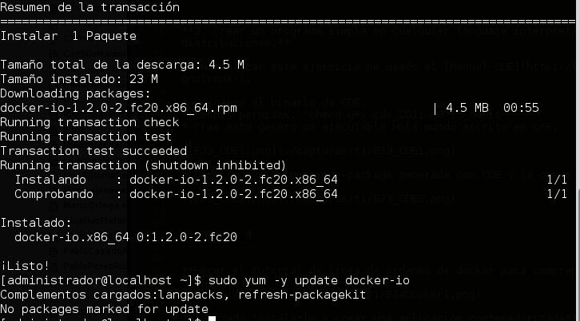
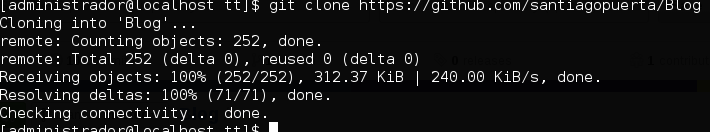

Introducción a la infraestructura virtual: concepto y soporte físico
====================================================================

Ejercicio 1
-----------

**Consultar en el catálogo de alguna tienda de informática el precio de un ordenador tipo servidor y calcular su coste de amortización a cuatro y siete años. Consultar artículo en Infoautónomos sobre el tema.**


He encontrado el siguiente ordenador tipo servidor: IBM System x 3100 M4 - Servidor (3.1 GHz, Intel Xeon, E3-1220V2, 1000 GB, 7200 RPM, 1000 GB)

[Enlace del servidor consultado a día 07/10/2014](http://www.amazon.es/IBM-System-3100-M4-E3-1220V2/dp/B00H98WRQG/ref=sr_1_8?ie=UTF8&qid=1412070393&sr=8-8&keywords=servidor)

El precio del servidor es de 854,80 Euros IVA incluido. Para la amortización no tendré encuenta el gasto del IVA, debido a que se deduce el año en el que se compra (IVA soportado). 

Para amortizarlo en cuatro años, usando una amortización de forma lineal, anotaré como gasto de amortización cada año:

- Supongo que el servidor lo voy a comprar el 1 de enero de 2015.
- El precio del servidor sin IVA es de 706,45 Euros.
- La amortización lineal 706,45 Euros / 4 Años = **176,60 Euros a amortizar.**

Para amortizarlo en siete años, usando una amortización de forma lineal, anotaré como gasto de amortización cada año:

- Supongo que el servidor lo voy a comprar el 1 de enero de 2015.
- El precio del servidor sin IVA es de 706,45 Euros.
- La amortización lineal 706,45 Euros / 7 Años = **100,90 Euros a amortizar.**


-----

Ejercicio 2
-----------

**Usando las tablas de precios de servicios de alojamiento en Internet y de proveedores de servicios en la nube, Comparar el coste durante un año de un ordenador con un procesador estándar (escogerlo de forma que sea el mismo tipo de procesador en los dos vendedores) y con el resto de las características similares (tamaño de disco duro equivalente a transferencia de disco duro) si la infraestructura comprada se usa sólo el 1% o el 10% del tiempo.**


Voy a comparar un servidor en nube con un VPS, para ello, he elegido como VPS [Gigas a 26/10/2014](https://gigas.com/cloud-vps) y de nube a Amazon EC2 [Amazon EC2 a 26/10/2014](http://aws.amazon.com/es/ec2/pricing/), ambos con 4 gigas de ram y 2 vCore.

**Precios de Amazon EC2 t2.medium**


**Precios de Gigas pro**


**Usando un 1% del tiempo:**

- Con Gigas, pagaría siempre el mes completo, puesto que no da la opción para usarlo por horas, en este caso 29 € al mes, entonces el coste por año seria de 29 * 12 = 348 €

- Con Amazon EC2 pagaría (0.0409658487 €/h * 24 h * 30 dias * 12 meses) * 0.01 = 3.53 €

**Usando un 10% del tiempo:**

- Con Gigas, pagaría siempre el mes completo, puesto que no da la opción para usarlo por horas, en este caso 29 € al mes, entonces el coste por año seria de 29 * 12 = 348 €

- Con Amazon EC2 pagaría (0.0409658487 €/h * 24 h * 30 dias * 12 meses) * 0.1 = 35.3 €


-----

Ejercicio 3
-----------

**1. ¿Qué tipo de virtualización usarías en cada caso? Comentar en el foro**

Comentario en el foro: [https://github.com/JJ/GII-2014/issues/71#issuecomment-60533869](https://github.com/JJ/GII-2014/issues/71#issuecomment-60533869)

- Para alojar a varios clientes en un sólo servidor, creo que lo más adecuado es la virtualización a nivel de sistema operativo, porque solo el administrador administraría el sistema evitando a los usuarios esa tarea.

- Para crear un sistema eficiente de web + middleware + base de datos, creo que lo correcto sería una virtualización plena, puesto que con ella tendríamos todos los aspectos de un ordenador para poder ejecutar otros programas sin modificar.

- Para un sistema de prueba de software e integración continua, claramente usaría la virtualización de entornos de desarrollo, ya que se reproduciría el entorno de producción de la forma más real.


**2. Crear un programa simple en cualquier lenguaje interpretado para Linux, empaquetarlo con CDE y probarlo en diferentes distribuciones.**

Para realizar este ejercicio he usado el [Manual CDE](http://linuxzone.es/2012/06/04/creando-aplicaciones-portables-en-gnulinux/).

* Descargo el binario de CDE.
* Cambio permisos. `chmod u+x cde_2011-08-15_64bit`
* Tras esto genero un ejecutable Hola mundo escrito en c++.

```c++
#include <iostream>

using namespace std;

int main() {

    cout << "Hola Mundo" << endl;

    return 0;

}
```


* Comprimo la carpeta cde-package generada con CDE y la copio a una máquina con Ubuntu y lo pruebo.


-----

Ejercicio 4
-----------

**Hacer el tutorial de línea de órdenes de docker para comprender cómo funciona.**



**Avanzado Instalarlo y crear una aplicación contenedorizada**

Para instalar docker he seguido el siguiente manual: [Manual de instalación de Docker para fedora](https://docs.docker.com/installation/fedora/).

```shell
# Instalar docker
sudo yum -y install docker-io

# Iniciar docker
sudo systemctl start docker

# Encender el servicio
sudo systemctl enable docker

# Probar docker
sudo docker run -i -t fedora /bin/bash

# Añadir usuario al grupo
usermod -a -G docker administrador
```




-----

Ejercicio 5
-----------

**Instala el sistema de gestión de fuentes git**

```shell
sudo yum install git
```


-----

Ejercicio 6
-----------

**1. Crear un proyecto y descargárselo con git. Al crearlo se marca la opción de incluir el fichero README.**

* Ya tengo varios proyectos en github, voy a usar [https://github.com/santiagopuerta/Blog](https://github.com/santiagopuerta/Blog)
* Lo clono `git clone https://github.com/santiagopuerta/Blog`




**2. Modificar el readme y subir el fichero modificado.**


-----

Ejercicio 7
-----------

**Comprobar si en la instalación hecha se ha instalado cgroups y en qué punto está montado, así como qué contiene.**

Como estoy usando ubuntu, ya viene montada por defecto la carpeta `/sys/fs/cgroup`.


Ejercicio 10
-----------

**Comprobar si el procesador o procesadores instalados lo tienen. ¿Qué modelo de procesador es? ¿Qué aparece como salida de esa orden?**

Para comprobar si tengo activada la virtualización a nivel de hardware, voy a ejecutar el siguiente comando:

```bash
egrep '^flags.*(vmx|svm)' /proc/cpuinfo
``` 
En la siguiente captura muestro el resultado de ejecutar el comando anterior en mi máquina.


Como se ha podido observar en la captura, la funcionalidad de virtualización a nivel de hardware existe y se encuentra activada.

Para comprobar el modelo de procesador que tengo, uso el siguiente comando:
```bash
cat /proc/cpuinfo
``` 
El modelo de procesador es: **Intel(R) Core(TM) i5-3230M CPU @ 2.60GHz**


