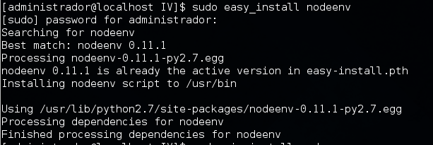

Creando aplicaciones en la nube: Uso de PaaS y SaaS.
====================================================================

Ejercicio 1
-----------

**Instalar un entorno virtual para tu lenguaje de programación favorito (uno de los mencionados arriba, obviamente).**

Para el desarrollo de este ejercicio, voy a usar node.js y su entorno de programación nodeenv.
He instalado node.js y tras esto instalo nodeenv con el comando:
```bash
sudo easy_install nodeenv
```

Una vez instalado nodeenv, paso a activar el entorno de programación con el comando:
```bash
 nodeenv env
 ```
Siendo **env** el directorio de trabajo. Una vez iniciado, ya se podrá utilizar el entorno de desarrollo.


-----

Ejercicio 2
-----------

**Darse de alta en algún servicio PaaS tal como Heroku, Nodejitsu u OpenShift.**

He decidido darme de alta en el servicio PaaS Heroku.

