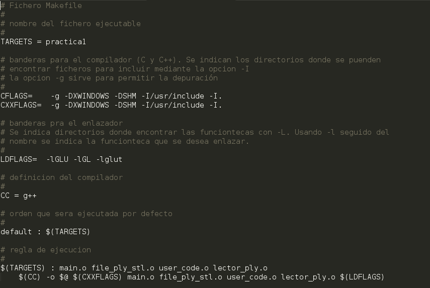
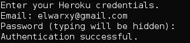
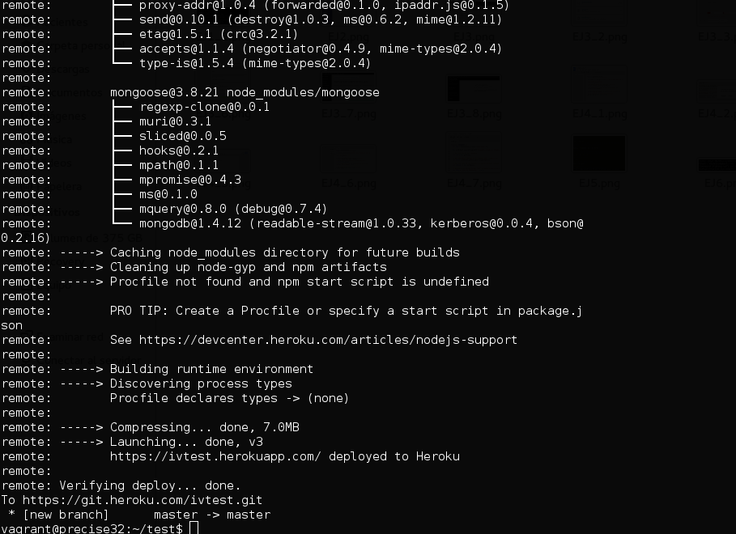

Creando aplicaciones en la nube: Uso de PaaS y SaaS.
====================================================================

Ejercicio 1
-----------

**Instalar un entorno virtual para tu lenguaje de programación favorito (uno de los mencionados arriba, obviamente).**

Para el desarrollo de este ejercicio, voy a usar node.js y su entorno de programación nodeenv.
He instalado node.js y tras esto instalo nodeenv con el comando:
```bash
sudo easy_install nodeenv
```

Una vez instalado nodeenv, paso a activar el entorno de programación con el comando:
```bash
 nodeenv env
 ```
Siendo **env** el directorio de trabajo. Una vez iniciado, ya se podrá utilizar el entorno de desarrollo.


-----

Ejercicio 2
-----------

**Darse de alta en algún servicio PaaS tal como Heroku, Nodejitsu u OpenShift.**

He decidido darme de alta en el servicio PaaS Heroku.


-----

Ejercicio 3
-----------

**Crear una aplicación en OpenShift y dentro de ella instalar WordPress.**

Como no tengo cuenta en [OpenShift](https://www.openshift.com/), lo primero que hare sera registrarme.

Tras registrarme, voy a crear una nueva aplicación. En mi caso, voy a seleccionar **Wordpress 4**.

Nos pedirá una serie de datos, como el nombre de subdominio que queremos, etc...

Los completo, pulso en **Create Application** y espero a que temine la instalación.

Una vez completa la instalación, nos mostrará información relacionada con lo que tenemos instalado:


Tras esto, queda configurar la instalación de wordpress, para ello accedemos a la direccion que nos indica la captura anterior, en mi caso a [wordpress santiago](http://wordpress-santiagopuerta.rhcloud.com/) que nos redireccionará automaticamente a la configuración de wordpress.


Una vez configurado, podremos acceder al menú de administración de wordpress o ver el [wordpress santiago](https://wordpress-santiagopuerta.rhcloud.com/).


-----

Ejercicio 4
-----------

**Crear un script para un documento Google y cambiarle el nombre con el que aparece en el menú, así como la función a la que llama.**

Siguiendo la página de developers de google [tu primer script](https://developers.google.com/apps-script/overview#your_first_script), voy a realizar mi primer script para Google drive.

Codigo que usaré:
```javascript
function createAndSendDocument() {
  var doc = DocumentApp.create('Hola mundo!');

  doc.getBody().appendParagraph('Documento creado por Google Apps Script.');

  // Get the URL of the document.
  var url = doc.getUrl();

  // Get the email address of the active user - that's you.
  var email = Session.getActiveUser().getEmail();

  // Get the name of the document to use as an email subject line.
  var subject = doc.getName();

  // Append a new string to the "url" variable to use as an email body.
  var body = 'Link al documento: ' + url;

  // Send yourself an email with a link to the document.
  GmailApp.sendEmail(email, subject, body);
}
```

Lo primero es acceder a [scripts google](http://www.google.com/script/start/) y pulsar sobre **Start Scripting** y seleccionar para que queremos el script, en mi caso para drive. Una vez seleccionado podremos insertar nuestro script.


Tras insertarlo, lo guardamos y lo ejecutamos pulsando el boton de play. Esto nos va a pedir permisos:


Los aceptamos y esto, segun el script nos enviará un email a un documento con el nombre **Hola mundo!**


Para cambiarle el nombre al script, pulsamos en la flecha que hay al lado del nombre y **Rename**.


Para cambiarle el nombre a la función, lo podemos hacer directamente en el codigo y despues guardar.


-----

Ejercicio 5
-----------

**Buscar un sistema de automatización de la construcción para el lenguaje de programación y entorno de desarrollo que usemos habitualmente.**

Un sistema de automatización que estoy usando es el Make. En la siguiente imagen muestro un ejemplo.



-----

Ejercicio 6
-----------

**Identificar, dentro del PaaS elegido o cualquier otro en el que se dé uno de alta, cuál es el fichero de automatización de construcción e indicar qué herramienta usa para la construcción y el proceso que sigue en la misma.**

Usando **heroku** con node.js es el package.json el que determina que version de node.js se va a usar, el nombre del proyecto, versión y descripción del mismo, que scripts se van a ejecutar, repositorio del proyecto, licencia, dependencias, etc...

En mi caso, voy a usar el package.json del proyecto [virtual vulcano](https://github.com/ernestoalejo/virtual-vulcano/blob/master/web/package.json)

En heroku hay que seguir los siguientes pasos:
- Instalar heroku.
```bash
wget -qO- https://toolbelt.heroku.com/install-ubuntu.sh | sh
```
- Hacer login en heroku.
```bash
heroku login
```

- Acceder al directorio de trabajo e iniciar git.
```bash
git init
```
- Añadir remote de heroku.
```bash
heroku git:remote -a ivtest
```
- Añadir un package.json en mi caso ([virtual vulcano](https://github.com/ernestoalejo/virtual-vulcano/blob/master/web/package.json))
- Añadir a git el package.json y realizar un commits con los cambios.
- Hacer un push a la rama heroku master.
```bash
git push heroku master
```
Al hacer el push, se va a realizar todo lo especificado en el package.json.


