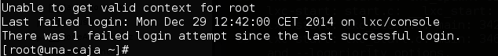

Virtualización ligera usando contenedores
====================================================================

Ejercicio 1
-----------

**Instala LXC en tu versión de Linux favorita. Normalmente la versión en desarrollo, disponible tanto en GitHub como en el sitio web está bastante más avanzada; para evitar problemas sobre todo con las herramientas que vamos a ver más adelante, conviene que te instales la última versión y si es posible una igual o mayor a la 1.0.**

Instalo en fedora con el siguiente comando:
```bash
sudo yum install lxc
```

Una vez que he instalado compruebo si mi máquina es compatible y si se encuentra lxc instalado con el comando:
```bash
lxc-checkconfig
```


Como esta todo **enabled** esto indica que puedo usarlo.


Ejercicio 2
-----------

**Comprobar qué interfaces puente se han creado y explicarlos.**

Tras instalar lxc he intentado crear un contenedor con el comando que se indica en el [temario](http://jj.github.io/IV/documentos/temas/Contenedores) pero me ha salido el siguiente error:
```bash
lxc_container: lxccontainer.c: get_template_path: 867 No such file or directory - bad template: fedora
lxc_container: lxccontainer.c: lxcapi_create: 1264 bad template: fedora
lxc_container: lxc_create.c: main: 271 Error creating container una-caja
```

Para solucionarlo, he instalado lxc-templates. 
```bash
sudo yum install lxc-templates
```

Tras esto me vuelve a salir otro error:
```bash
'debootstrap' command is missing
lxc_container: lxccontainer.c: create_run_template: 1125 container creation template for una-caja failed
lxc_container: lxc_create.c: main: 271 Error creating container una-caja
```

Que para solucionarlo, he instalado **debootstrap**:
```bash
sudo yum install debootstrap
```
Tras esto ya si podre crear el contenedor:
```bash
sudo lxc-create -t fedora -n una-caja
```

Espero a que termine y paso a iniciarla:
```bash
sudo lxc-start -n una-caja
```

Pero me encuentro con el siguiente error:
```bash
lxc-start: conf.c: instantiate_veth: 2978 failed to attach 'vethDWA76E' to the bridge 'virbr0': No such device
lxc-start: conf.c: lxc_create_network: 3261 failed to create netdev
lxc-start: start.c: lxc_spawn: 826 failed to create the network
lxc-start: start.c: __lxc_start: 1080 failed to spawn 'una-caja'
lxc-start: lxc_start.c: main: 342 The container failed to start.
lxc-start: lxc_start.c: main: 346 Additional information can be obtained by setting the --logfile and --logpriority options.
```

Para solucionarlo, he seguido el paso **Install management libraries and utilities** de la web [major.io](https://major.io/2014/04/21/launch-secure-lxc-containers-on-fedora-20-using-selinux-and-svirt/)

He usado lo siguiente:
- He eliminado el contenedor:
```bash
sudo lxc-destroy -n una-caja
```
- He instalado las librerias para el uso de red y se activan:
```bash
sudo yum install libvirt-daemon-lxc libvirt-daemon-config-network
sudo systemctl start libvirtd.service
sudo systemctl enable libvirtd.service
```
- Tras esto ya se puede crear el contenedor e iniciar:
```bash
sudo lxc-create -t fedora -n una-caja
sudo lxc-start -n una-caja
```

Para los comando basicos de **lxc* he usado [linuxcontainers.org](https://linuxcontainers.org/lxc/manpages/)


Tras todo esto paso a indicar las interfaces que se han creado:

Se me ha creado la interfaz **virbr0** para que el contendor tenga acceso a internet.


Ejercicio 3
-----------

**Crear y ejecutar un contenedor basado en Debian.**

**Crear y ejecutar un contenedor basado en otra distribución, tal como Fedora. Nota En general, crear un contenedor basado en tu distribución y otro basado en otra que no sea la tuya. Fedora, al parecer, tiene problemas si estás en Ubuntu 13.04 o superior, así que en tal caso usa cualquier otra distro. Por ejemplo, [Óscar Zafra ha logrado instalar Gentoo usando un script descargado desde su sitio, como indica en este comentario en el issue.](https://github.com/IV-GII/GII-2013/issues/87#issuecomment-28639976)**

Para crear el contenedor Debian y ejecutarlo:
```bash
sudo lxc-create -t debian -n debian
sudo lxc-start -n debian
```


Para crear el contenedor CentOs y ejecutarlo:
```bash
sudo lxc-create -t centos -n centos
sudo lxc-start -n centos
```


Ejercicio 4
-----------

**Instalar lxc-webpanel y usarlo para arrancar, parar y visualizar las máquinas virtuales que se tengan instaladas.**
**Desde el panel restringir los recursos que pueden usar: CPU shares, CPUs que se pueden usar (en sistemas multinúcleo) o cantidad de memoria.**

Para la instalación de LXC Web Panel uso el manual de la pagina del [proyecto](http://lxc-webpanel.github.io/install.html) pero no he conseguido instalarlo en fedora. Voy a instalarlo en una máquina virtual con ubuntu.
```bash
wget http://lxc-webpanel.github.com/tools/install.sh -O - | bash
```
Tras instalarlo, accedo a http://localhost:5000 con usuario admin y contraseña admin.

Para cambiar los recursos de cada contenedor es muy facil, tan solo pinchando encima del nombre nos mostrará las opciones.


Ejercicio 6
-----------

**Instalar juju.**

Añado repositorio de juju y lo instalo tal cual lo indica el temario de la asignatura.
```bash
sudo add-apt-repository ppa:juju/stable
sudo apt-get update && sudo apt-get install juju-core
```


**Usándolo, instalar MySQL en un táper.**
Para empezar a trabajar con el:
```bash
juju init
```

Tras esto voy a editar el fichero de configuracion de juju para su uso en local, cambio #default: amazon por default: local


Como se indica en el temario, se necesita instalar mongodb-server para usar juju en local, por lo tanto lo instalo.

```bash
sudo apt-get install mongodb-server
```

Ahora establezco donde voy a trabajar:
```bash
sudo juju switch local
```
Según se indica, juju usa taper que cree el, por tanto vamos a crear uno.


Para instalar mysql usaré:
```bash
sudo juju deploy mysql
```

Ahora para comprobar que se ha instalado correctamente, uso el comando:
```bash
sudo juju status
```
Que muestra el servicio mysql instalado.


