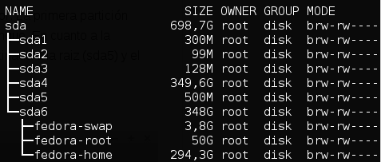
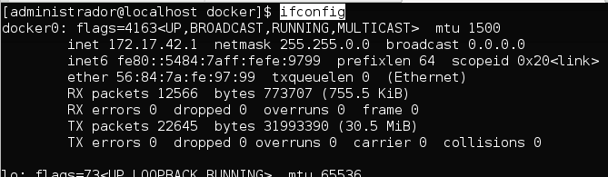
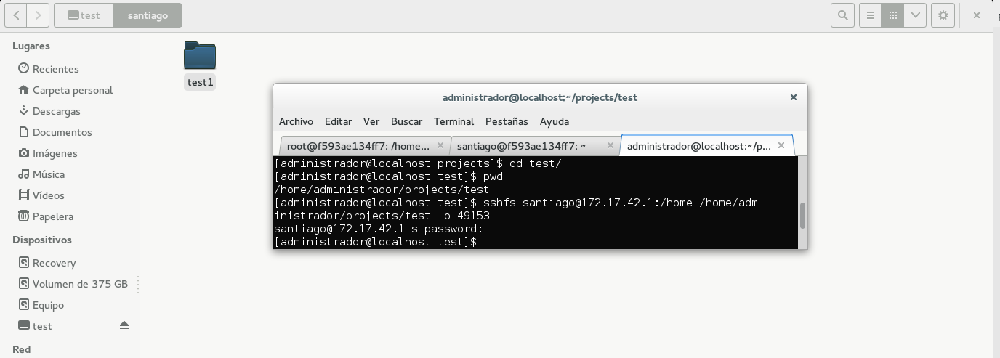

Virtualización del almacenamiento
====================================================================

Ejercicio 1
-----------

**¿Cómo tienes instalado tu disco duro? ¿Usas particiones? ¿Volúmenes lógicos?**

**Si tienes acceso en tu escuela o facultad a un ordenador común para las prácticas, ¿qué almacenamiento físico utiliza?**

En mi disco duro tengo las siguientes particiones:


- Una partición para boot.
- Una para Windows.
- Una partición para Fedora.

Para Fedora tengo tres volumenes logicos:
- swap.
- root.
- home.

**Buscar ofertas SAN comerciales y comparar su precio con ofertas locales (en el propio ordenador) equivalentes.**

[SAN iSCSI PowerVault serie MD3 de 1 GB MD3260i](http://www.dell.com/es/empresas/p/powervault-md3200i/pd)
- Precio de 8.364 €.
- Permite hasta 60 unidades SSD de 3,5" de hasta 4 TB cada una.
- 8 puertos 1Gbps.
- 2 GB de caché.
- Usa protocolo iSCSI.
- Con la posibilidad de intercambio en caliente.

[SAN D-Link DSN-1100-10](http://www.audiotronics.es/product.aspx?productid=91108)
- Precio de 1.525,26 €.
- Admite 5 discos duros SATA/SATA-II de 3,5".
- 4 puertos 1Gbps.
- Usa protocolo iSCSI.
- Con la posibilidad de intercambio en caliente.
- 1 GB de caché.


-----

Ejercicio 2
-----------

**Usar FUSE para acceder a recursos remotos como si fueran ficheros locales. Por ejemplo, sshfs para acceder a ficheros de una máquina virtual invitada o de la invitada al anfitrión.**

Como no tengo instalado sshfs, lo instalo en el anfitrion y en la máquina virtual.
Para poder conectarme con la máquina servidora, necesito saber su ip, usando ifconfig en la anfitriona saco la ip:


Me conecto a la máquina virtual e instalo con:
```bash
sudo apt-get install sshfs
```
Para la máquina anfitriona fedora instalo con:
```bash
sudo yum install sshfs
```
Tras instalarlo, en la máquina virtual voy a añadir al grupo de usuario **fuse** el nombre de usuario con el que me voy a conectar remotamente.
En mi caso:
```bash
sudo usermod -a -G fuse santiago
```
Ahora en mi máquina anfitriona, creo una carpeta test que se sincronizará con la virtual.
Tras esto paso a usar sshfs, en mi caso:
```bash
sshfs santiago@172.17.42.1:/home /home/administrador/projects/test -p 49153
```
Captura de pantalla que muestra como se a montado la carpeta test



-----

Ejercicio 3
-----------

**Crear imágenes con estos formatos (y otros que se encuentren tales como VMDK) y manipularlas a base de montarlas o con cualquier otra utilidad que se encuentre.**

He instalado qemu con el siguiente comando:
```bash
sudo apt-get install qemu-system
```

Voy a crear varias imágenes con varios formatos, para ello uso los siguientes comandos:
```bash
# qcow2
qemu-img create -f qcow2 fichero-cow.qcow2 5M

# raw
qemu-img create -f raw fichero-raw.raw 5M

# vdi
qemu-img create -f vdi fichero-vdi.vdi 5M
```

Ahora montaré la imagen qcow2 con el siguiente comando:
```bash
sudo losetup -v -f fichero-cow.qcow2
sudo losetup -v -f fichero-cow.qcow2
```


-----

Ejercicio 4
-----------

**Crear uno o varios sistema de ficheros en bucle usando un formato que no sea habitual (xfs o btrfs) y comparar las prestaciones de entrada/salida entre sí y entre ellos y el sistema de ficheros en el que se encuentra, para comprobar el overhead que se añade mediante este sistema.**


-----

Ejercicio 5
-----------

**Instalar ceph en tu sistema operativo.**

Para instalarlo he usado el siguiente comando:
```bash
sudo apt-get install ceph-mds
```

