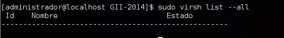

Virtualización completa: uso de máquinas virtuales
====================================================================

Ejercicio 1
-----------

**Instalar los paquetes necesarios para usar KVM. Se pueden seguir estas instrucciones. Ya lo hicimos en el primer tema, pero volver a comprobar si nuestro sistema está preparado para ejecutarlo o hay que conformarse con la paravirtualización.**

Lo instale para el tema 1, para instalarlo, usé:
```bash
sudo yum install qemu-kvm libvirt-bin
```
Si uso el comando ``bash virsh list --all`` puedo ver que funciona y que en mi caso no tengo ninguna maquina virtual instalada.


