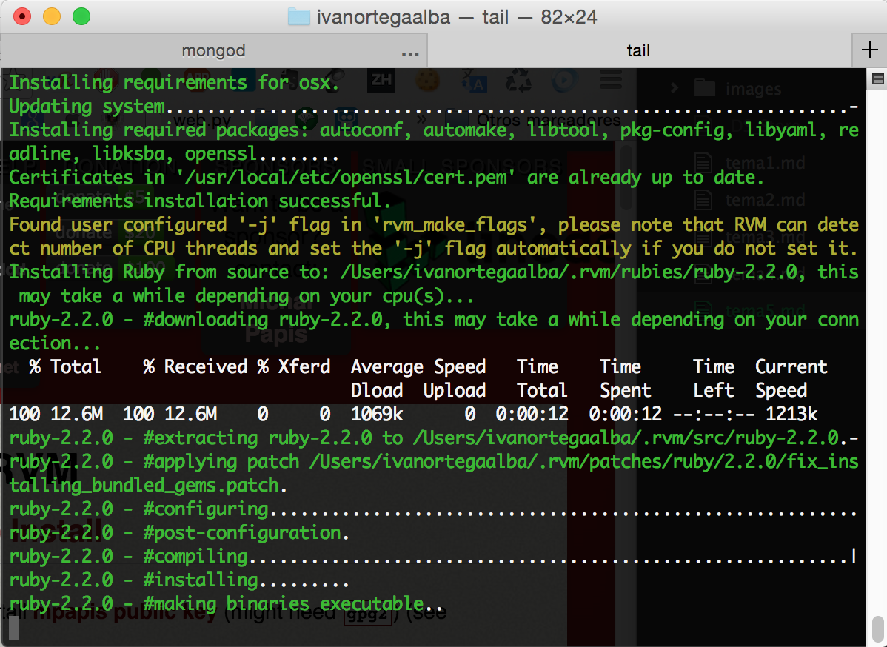

# Seminario: Ruby

## Ejercicio 1: Instalar Ruby y usar comprobar la versión instalada. A la vez, conviene instalar también irb, rubygems y rdoc.
La heramienta más popular para instalar Ruby es RVM (“Ruby Version Manager”).
Desde la [página oficial de Ruby](https://www.ruby-lang.org/es/downloads/) nos dan las instrucciones a seguir para instalarlo:
```
\curl -L https://get.rvm.io | bash -s stable --ruby
```
Esta herramienta nos permite instalar y controlar las distintas versiones de Ruby.

Con el anterior comando tenemos Ruby y RVM en su ultima versión estable.

Para comprobar que se ha instalado correctamente ejecutamos el comando:
```
MacBook-Pro-de-Ivan:ivanortegaalba ivanortegaalba$ ruby --version
ruby 2.0.0p481 (2014-05-08 revision 45883) [universal.x86_64-darwin14]
```
Donde podemos ver que tenemos ruby 2.0

Rdoc y el irb ya vienen instalados por defecto.
Para instalar rubygems descargamos la gema desde la [página oficial](https://rubygems.org/pages/download) e instalamos:

```
MacBook-Pro-de-Ivan:ivanortegaalba ivanortegaalba$ sudo gem install /Users/ivanortegaalba/Downloads/rubygems-update-2.4.5.gem
Successfully installed rubygems-update-2.4.5
Parsing documentation for rubygems-update-2.4.5
Installing ri documentation for rubygems-update-2.4.5
1 gem installed
```
## Ejercicio 2: Crear un programa en Ruby que imprima los números desde el 1 hasta otro contenido en una variable.

[Script](scriptRuby/ejercicio2.rb)

```
#!/usr/bin/ruby

$num = 50

for $i in 0..$num
  puts $i.to_s
end
```
## Ejercicio 3: ¿Se pueden crear estructuras de datos mixtas en Ruby? Crear un array de hashes de arrays e imprimirlo.

[Script](scriptRuby/ejercicio3.rb)

```
#!/usr/bin/ruby

array_hashes = {
  "clave1" => [1,2,3,4],
  "clave2" => [5,6,7,8],
  "clave3" => [9]
}

puts array_hashes.to_s

array_hashes.keys().each do |i|
puts array_hashes[i]
end
```


## Ejercicio 4: Crear una serie de funciones instanciadas con un URL que devuelvan algún tipo de información sobre el mismo: fecha de última modificación, por ejemplo. Pista: esa información está en la cabecera HTTP que devuelve

La estructura de header corresponde a :
```
    {
      :server => "nginx/1.4.7",
      :date => "Sat, 08 Nov 2014 19:44:58 GMT",
      :content_type => "application/json",
      :content_length => "303",
      :connection => "keep-alive",
      :content_disposition => "inline",
      :access_control_allow_origin => "*",
      :access_control_max_age => "600",
      :access_control_allow_methods => "GET, POST, PUT, DELETE, OPTIONS",
      :access_control_allow_headers => "Content-Type, x-requested-with"
    }
```
[Script](scriptRuby/ejercicio4.rb)

```
#!/usr/bin/ruby
# -*- coding: utf-8 -*-

  require 'net/http'

  def metodosPermitidos()
  response = Net::HTTP.get_response(ARGV[0],'/')
  return response['access_control_allow_methods'].to_s
  end

  def fecha()
  response = Net::HTTP.get_response(ARGV[0],'/')
  return response['date'].to_s
  end

  def servidor()
  response = Net::HTTP.get_response(ARGV[0],'/')
  return response['server'].to_s
  end

  def length()
  response = Net::HTTP.get_response(ARGV[0],'/').to_s
  return response['content_length'].to_s
  end

  def tipoConexion()
  response = Net::HTTP.get_response(ARGV[0],'/').to_s
  return response['connection'].to_s
  end

  puts "Metodos Permitidos:" + metodosPermitidos()
  puts "Fecha :" + fecha()
  puts "Servidor:" + servidor()
  puts "Longitud :" + length()
  puts "Tipo de conexión :" + tipoConexion()

```
## Ejercicio 5: Ver si está disponible Vagrant como una gema de Ruby e instalarla.

Para buscar la gema, tendremos que buscar en le repositorio remoto con:

```
MacBook-Pro-de-Ivan:scriptRuby ivanortegaalba$ gem search --remote vagrant

    *** REMOTE GEMS ***

    berkshelf-vagrant (1.1.3)
    bib-vagrant (0.1.1)
    bmabey-vagrant (0.2.0)
    bmhatfield-vagrant (1.0.10)
    cap_vagrant (0.0.1)
    capistrano-strategy-vagrant-copy-bundled (0.1.0)
    chef-metal-vagrant (0.7)
    chef-provisioning-vagrant (0.8.1)
    chino-vagrant-hostmaster (0.8.1)
    coral_vagrant (0.2.8)
    furnish-vagrant (0.1.1)
    guard-rake-vagrant (0.0.3)
    jamie-vagrant (0.5.2)
    kitchen-driver-vagrant_provision (1.0.0)
    kitchen-vagrant (0.15.0)
    kitchen-vagrant_sandbox (0.1.1)
    kitchen-vagrant_winrm (0.2.1)
    knife-vagrant (0.0.7)
    knife-vagrant2 (0.0.6)
    knife-vagrant3 (0.0.2)
    lh-vagrant-dns (0.0.6)
    librarian-puppet-vagrant (0.0.1)
    ll-vagrant (0.0.1)
    ll-vagrant-aws (0.0.1)
    mojolingo-vagrant-librarian-puppet (0.7.1)
    nise-bosh-vagrant (0.5.2)
    nixme-vagrant (0.7.2)
    outoftime-vagrant-librarian-puppet (0.7.1.1416968000)
    pleschev-vagrant-hostmaster (0.8.1)
    realityforge-vagrant-windows (0.1.4)
    rs_vagrant_shim (0.2.0)
    salty-vagrant-grains (0.0.2)
    secured-cloud-vagrant (1.0.0)
    tcr-vagrant-google (0.1.4)
    tvd-vagrant (0.0.26)
    vagrant (1.5.0)
```

Para instalarlo basta con:
```
sudo gem install vagrant
```
