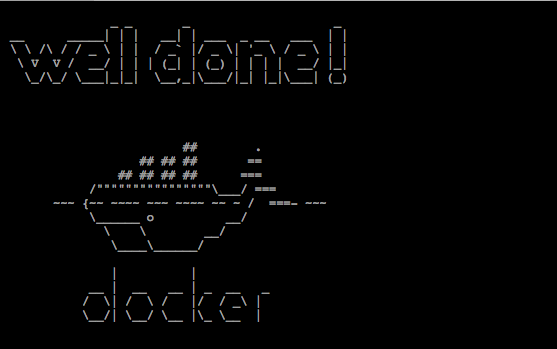
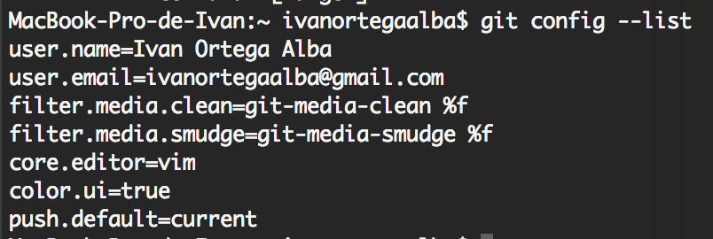
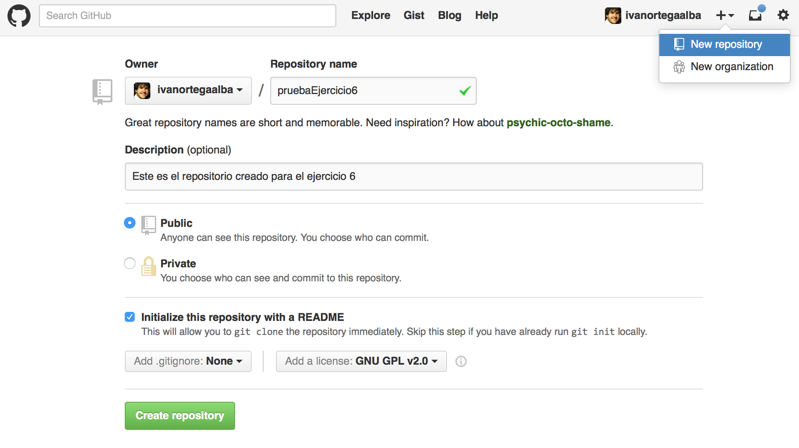
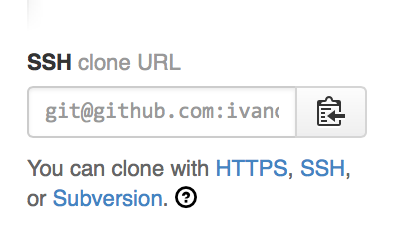

# Practica 1
## Ejercicio 1

El servidor a amortizar es [HP ProLiant ML310e G8 XE E3-1220/8GB/2TB](http://www.pccomponentes.com/hp_proliant_ml310e_g8_xe_e3_1220_8gb_2tb.html)
Precio: *645€*

Para que esta máquina sea amortizada en el plazo de 4 años, nos ha de dar un 25% de su valor cada año.
Para esto ha de darnos: 645 * 0.25 = 161.25€ por año.

Por tanto, para amortizarlo en 7 años, volvemos a hacer: 645 / 7 = 92.142 € por año.

## Ejercicio 2

Vamos a hacer una comparativa entre 2 servicios de hosting, estos van a ser

## Ejercicio 3

Siguiendo con la tradición, vamos a hacer un "Hola CDE" para BASH, el nombre del fichero sera hello-CDE.sh:

````````````
$ cat hello-CDE.sh

  #!/bin/bash
  echo "Hello CDE";

````````````

Damos permisos de ejecución ( ``` sudo chmod +x ./hello-CDE.sh ``` )y ya tenemos listo nuestro script.

Ahora vamos a instalar el cde:
```
sudo apt-get install cde
```
Para crear nuestro paquete de la aplicación con todas las dependencias, usamos:
```
$ cde hello-CDE.sh
```
Comprimimos nuestro fichero y lo mandamos por ftp a nuestro otro equipo(es una VM) con la distribución Kali:

```
tar -cvf cde-hello-CDE.tar cde-package/
$ sftp kali@192.168.56.102
$ put cde-hello-CDE.tar
```
Ya solo falta descromprimir y ejecutarlo:
```
$ tar -zxvf cde-hello-CDE.tar
$ ./cde-package/hello-CDE.cde
  Hello CDE!
```

## Ejercicio 4



## Ejercicio 5

La instalación de Git, vamos a hacerla sobre OS X. Git puede instalarse en cualquier SO de los comunes. Yo he escogido OS X, porque on estoy acostumbrado a usarlo para desarrollar y quiero aprender su funcionamiento, que más adelante veremos que es prácticamente igual.
Para instalarlo basta que sigamos el libro oficial de [Git Pro](http://git-scm.com/book/es/Empezando-Instalando-Git).

Hay tres maneras de instalarlo:
- Con el instalador [descargandolo de SourceForge](http://sourceforge.net/projects/git-osx-installer/).
- Con MacPorts:
````````````
sudo port install git-core +svn +doc +bash_completion +gitweb
````````````
- Con Homebrew:
````````````
brew install  Git
 ````````````
 En mi caso he optado por la tercera opción, y es simplemente ejecutar ese comando.

 Ahora, hemos de configurar las opciones básicas de Git:
 - Tu identidad:Esto es importante porque las confirmaciones de cambios (commits) en Git usan esta información, y es introducida de manera inmutable en los commits que envías.
 ````````````
$ git config --global user.name "Ivan Ortega"
$ git config --global user.email ivanortegaalba@gmail.com
 ````````````
 - Tu editor: puedes elegir el editor de texto por defecto que se utilizará cuando Git necesite que introduzcas un mensaje, en mi caso prefiero vim.

 ````````````
 $ git config --global core.editor vim
 ````````````
 Además, a mi personalmente, cuando saque información, me gusta que me la dé en color.
 ```
$ git config --global color.ui true
 ```
Finalmente podemos comprobar nuestra información con:
 ````````````
$ git config --list
 ````````````
  

## Ejercicio 6

Vamos a crear un proyecto desde GitHub, aunque también podríamos hacerlo desde nuestro equipo y despues ejecutar ```git init```para iniciar el repositorio.

  

Ahora vamos a descargarlo. Tememos varias opciones, pero las típicas son por http y ssh.

Yo ya tengo configurado mi ssh para poder hacer cambios en mi repositorio remoto sin tener que autenticarme.

Por lo que voy a descargar la versión SSH

  

Para tenerlo en nuestro local, nos movemos hasta la carpeta donde queremos clonarlo y ejecutamos el comando:
```
$ git clone git@github.com:ivanortegaalba/pruebaEjercicio6.git
Cloning into 'pruebaEjercicio6'...
remote: Counting objects: 4, done.
remote: Compressing objects: 100% (4/4), done.
remote: Total 4 (delta 0), reused 0 (delta 0)
Receiving objects: 100% (4/4), 6.96 KiB | 0 bytes/s, done.
Checking connectivity... done.
```
Ahora voy a modificar el README.md.
```
$ echo "hola mundo " >> pruebaEjercicio6/README.md
```
Después añado el archivo para que lo trackee el git con el comando

```
$ git add README.md
```

Una vez git sabe de su existencia, ya podemos hacer commit con los cambios. Es necesario añadir un comentario:
```
$ git commit -m "Modificación del README.md"
[master d018945] Modificación del README.md
 1 file changed, 2 insertions(+)
```
Ya lo tenemos en nuestro HEAD listo para ser enviado. Solo falta enviarlo al servidor remoto con:
```
$ git push
Counting objects: 3, done.
Delta compression using up to 4 threads.
Compressing objects: 100% (3/3), done.
Writing objects: 100% (3/3), 341 bytes | 0 bytes/s, done.
Total 3 (delta 1), reused 0 (delta 0)
To git@github.com:ivanortegaalba/pruebaEjercicio6.git
   bd7fdb4..d018945  master -> master
```

## Ejercicio 7

Para ver los archivos montados de cgroups, en mi caso en Ubuntu, hemos de ejecutar:
```
$ ls /sys/fs/cgroup/
systemd
```
En mi casa solo sale systemd y dentro de este encontramos:
```
$ ls /sys/fs/cgroup/systemd/
cgroup.clone_children  cgroup.event_control  cgroup.procs  cgroup.sane_behavior  notify_on_release  release_agent  tasks  user
```

## Ejercicio 10

El procesador con el que esta corriendo Linux es:
Intel Core i5-4200M

Para ver los flags ejecutamos:
```
$ egrep '^flags.*(vmx|svm)' /proc/cpuinfo
```
Y vemos que no nos ha devuelto nada, por lo que no tenemos los flags activados.

Cuenta con la tecnología VT-x de Intel, pero al estar corriendo Linux (provisionalmente) en una maquina virtual, este no esta activo.

## Ejercicio 11

Para comprobar si nuestro sistema soporta KVM ejecutamos el comando:

```
$ kvm-ok
INFO: Your CPU does not support KVM extensions
INFO: For more detailed results, you should run this as root
HINT:   sudo /usr/sbin/kvm-ok
```
Como podemos ver, indica que no está activado. Esto puede ser a causa de que la máquina virtual no puede usar la aceleración por hardware del procesador, solo la máquina anfitrión.
