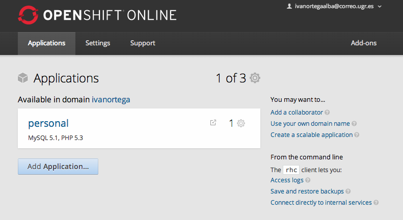
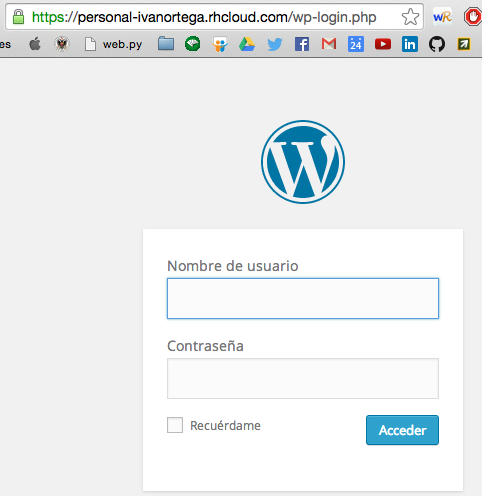
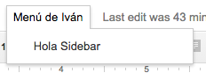
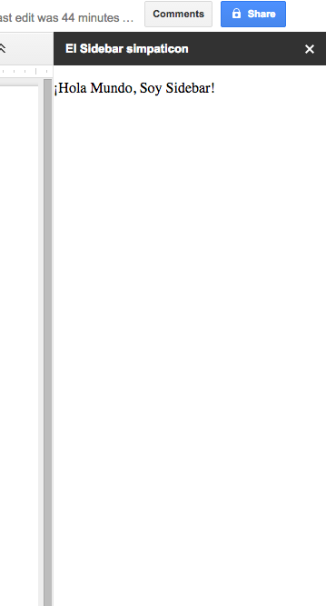
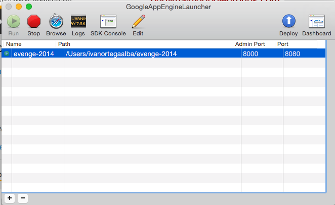
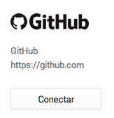

# Hito 2
## Ejercicio 1

En la práctica vamos a desarrollar con Pyhon por lo que vamos a instalar el entorno [virualenv](http://rukbottoland.com/blog/tutorial-de-python-virtualenv/)
Vamos a instalar su versión Linux usando [pip](http://rukbottoland.com/blog/como-instalar-un-paquete-python-con-pip/)

```
#Instalar pip para Linux
$ sudo apt-get install python-pip

#Instalar pip para Linux
$ sudo pip install virtualenv
  Downloading virtualenv-1.11.6-py2.py3-none-any.whl (1.6MB): 1.6MB downloaded
  Installing collected packages: virtualenv
  Successfully installed virtualenv
  Cleaning up...

```
Para crear un virtualenv simplemente se ejecuta el siguiente comando:

```
$ virtualenv env1_prueba
  New python executable in env1_prueba/bin/python
  Installing setuptools, pip...done.
$ ls env1_prueba/
  bin  include  lib  local
```
Para activar un entorno virtual, se procesa el archivo bin/activate que se encuentra en la carpeta que se ha creado al ejecutar la utilidad virtualenv:
```
$ cd env1_prueba
$ source bin/activate
  env1_prueba$
```
Ahora solo falta instalar los paquetes que vamos a necesitar con pip, en mi caso django:
```
(env1_prueba)$ pip install django
```
Podemos configurar nuestro entorno a nuestro gusto, y poder probar versiones y frameswork en distintos entornos.
Para la ubicación del código fuente del proyecto, no es importante.
Puede ser colocado inclusive dentro del directorio del virtualenv.
Una vez que el virtualenv está activado, todas las librerías de Python que instalen solo podrán ser usadas al activar ese virtualenv específico.

## Ejercicio 2

He decidido darme de alta en Openshif, porque había escuchado antes hablar de él, y me picaba la curiosidad.
Para darse de alta es muy sencillo. Es simplemente acceder a la página de [Openshift](https://www.openshift.com/):
```
https://www.openshift.com/
```
Y nos damos de alta en su servicio Public PaaS ONLINE.
Posteriormente, rellenamos los datos, y nos llegará un correo de confirmación.
Activamos nuestra cuenta, y ya estamos dados de alta en OpenShift.

Cuando nos logeemos, nos encontraremos algo como esto:
 

 En mi caso, ya sale una aplicación, porque tengo instalado un Wordpress.

 ## Ejercicio 3

 Para instalar Wordpress es muy sencillo. En el panel que hemos visto en el ejercicio anterior, hay una opción que es "Add Aplication".

 Aquí seleccionamos Wordpress y rellenamos los datos de configuración de la aplicación.
 Esperamos a que se instale.

 Posteriormente, entrando al panel de aplicaciones, tendremos la app instalada.
 

## Ejercicio 4

Vamos a crear una nueva opción del menú de Google Docs, y que nos muestre un Sidebar simpatico que nos salude cuando lo llamemos.

El código del script va a ser:

```
function onOpen() {
  DocumentApp.getUi().createMenu('Menú de Iván')
      .addItem('Hola Sidebar', 'sidebarHola')
      .addToUi();
}

function sidebarHola() {
    DocumentApp.getUi().showSidebar(
      HtmlService
          .createHtmlOutput('<p>¡Hola Mundo, Soy Sidebar!</p>')
          .setTitle('El Sidebar simpaticon')
          .setWidth(350));
}

```

Aquí podemos ver nuestro Sidebar simpaticón. =)




## Ejercicio 5

Para la automatización de Python, y su despliegue, Google App Engine cuenta con su SDK.
Cuenta con un entorno de desarrollo en local, donde monta un servidor de pruebas y puedes hacer el despliegue en GAE simplemente con un boton.



También existe la posibilidad de sincronizar GAE con GitHub y simplemente con un push en la rama google-master, tendremos nuestra rama desplegada.



Esta opción esta en el Dashboard de GAE.
## Ejercicio 6

Google App Engine consta de un archivo de configuración llamado app.yaml que contiene toda la configuración necesaria para el despliegue en la plataforma.
El despliegue se hace de forma automática mendiante su SDK.
Un ejemplo de este archivo puede ser este. Es el de nuestra aplicación en este momento.

```
application: evenge-2014
version: 1
runtime: python27
api_version: 1
threadsafe: yes

handlers:
- url: /favicon\.ico
  static_files: favicon.ico
  upload: favicon\.ico

- url: .*
  script: main.app

libraries:
- name: webapp2
  version: "2.5.2"
```

Donde se establecen las librerias utilizadas y muy importante, los handlers que reciben y devuelven la respuesta al navegador.

Con la configuración puesta correctamente en este archivo, solo falta subir con el SDK al GAE.


