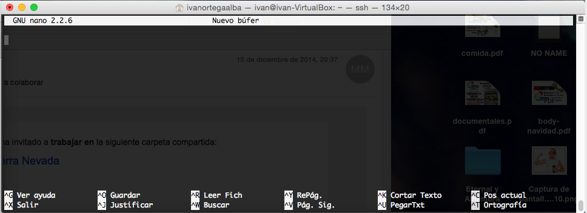
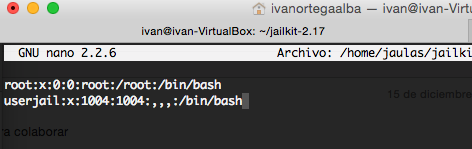

# Tema 3
## Ejercicio 1
Empezamos creando el nuevo espacio de nombres

```
sudo unshare -u /bin/bash
```
Posteriormente le damos nombre al hostname.

```
hostname iv-mount
```


Ya tenemos nuestro espacio de nombres, ahora podemos proceder a montar la imagen. Nosotros vamos a montar una que teníamos de Lubuntu.

Basta con usar el comando:

```
mount -o loop mini.iso /mnt/lubuntu-iv
```
Y nos montará nuestra imagen en el directorio lubuntu-iv


Podemos comprobarlo listando /mnt


## Ejercicio 2

1. Mostrar los puentes configurados en el sistema operativo.
Para mostrar los puentes, basta con ejecutar la orden

```
brctl show
```
Y como podemos ver no se muestra ninguno en este momento, ya que no tenemos ningun software de virtualización en este momento.


2. Crear un interfaz virtual y asignarlo al interfaz de la tarjeta wifi, si se tiene, o del fijo, si no se tiene.

Para crear una nueva interfaz virtual, basta con usar el comando

```
sudo brctl addbr iv-bridge
```

Y ya tendremos una nueva interfaz de puente, sin asignar a ninguna otra interfaz.

Este será el siguiente paso, y ejecutaremos:
```
sudo brctl addif iv-bridge eth0
```
Y quedará asignado a la interfaz Ethernet 0 de nuestro pc, ya que no disponemos de wlan. Como podemos ver, la interfaz se muestra como master de nuestro punete asociado:

Y si visualizamos los puentes de los que consta nuestro SO vemos:


## Ejercicio 3
1. Usar debootstrap (o herramienta similar en otra distro) para crear un sistema mínimo que se pueda ejecutar más adelante.

Primeramente instalamos Debootstrap con:

```
ivan@ivan-VirtualBox:~$ sudo apt-get install debootstrap
```
Creamos nuestra jaula con la versión de Linux saucy, por probar la misma del guión:
```
ivan@ivan-VirtualBox:~$ sudo debootstrap --arch=amd64 saucy /home/jaulas/saucy/ http://archive.ubuntu.com/ubuntu
  I: Retrieving Release
  [...]
  I: Base system installed successfully.
```
Con esto ya tenemos nuestro sistema creado.
2. Experimentar con la creación de un sistema Fedora dentro de Debian usando Rinse.

Desde la distro Debian instalamos Rinse:
```
ivan@ivan-VirtualBox:~$ sudo apt-get install rinse
```
Ahora creamos nuestro entorno Fedora igual que antes:
```
sudo rinse --arch=amd64 --distribution fedora-core-6 --directory /home/jaulas/fedora/
  [...]
  Installed: dhclient.x86_64 12:3.0.5-5.fc6
  Cleaning up
  Final tidy...
  Installation complete.
```
## Ejercicio 4

Instalar alguna sistema debianita y configurarlo para su uso. Trabajando desde terminal, probar a ejecutar alguna aplicación o instalar las herramientas necesarias para compilar una y ejecutarla.

Entramos en la jaua creada, vamos a usar la de saucy:
```
ivan@ivan-VirtualBox:~$ sudo chroot /home/jaulas/saucy
```
Montamos el directorio proc para que funcionen correctamentes las apps:
```
root@ivan-VirtualBox:/# mount -t proc proc /proc
```
Instalamos el paquete de idiomas:
```
root@ivan-VirtualBox:/# apt-get install language-pack-es
```

Como se pide ejecutar una aplicación, vamos a instalar el editor de textos nano:
```
root@ivan-VirtualBox:/# nano
  bash: nano: command not found
root@ivan-VirtualBox:/# sudo apt-get install nano
  
```

5. Instalar una jaula chroot para ejecutar el servidor web de altas prestaciones nginx.

Añadimos el repositorio a las listas de fuentes de apt:

```
root@ivan-VirtualBox:/# echo "deb http://nginx.org/packages/ubuntu/ raring nginx" >> /etc/apt/sources.list
root@ivan-VirtualBox:/# echo "deb-src http://nginx.org/packages/ubuntu/ raring nginx" >> /etc/apt/sources.list
```

Al actualizar tendremos este error:

```
W: Error de GPG: http://nginx.org raring Release: Las firmas siguientes no se pudieron verificar porque su llave pública no está disponible: NO_PUBKEY ABF5BD827BD9BF62
```

Por tanto, necesitaremos la clave pública:

```
root@ivan-VirtualBox:/# wget http://nginx.org/keys/nginx_signing.key
root@ivan-VirtualBox:/# apt-key add nginx_signing.key
  OK
```

Instalamos NGINX
```
root@ivan-VirtualBox:/# apt-get install nginx
```

Y arrancamos el servidor:

```
root@ivan-VirtualBox:/# service nginx start
```

Hacemos una petición al servidor para comprobar que funciona:

```
root@ivan-VirtualBox:/# curl localhost
  <!DOCTYPE html>
  <html>
  <head>
  <title>Welcome to nginx!</title>
  <style>
  body {
    width: 35em;
    margin: 0 auto;
    font-family: Tahoma, Verdana, Arial, sans-serif;
  }
  </style>
  </head>
  <body>
  <h1>Welcome to nginx!</h1>
  <p>If you see this page, the nginx web server is successfully installed and
  working. Further configuration is required.</p>

  <p>For online documentation and support please refer to
  <a href="http://nginx.org/">nginx.org</a>.<br/>
  Commercial support is available at
  <a href="http://nginx.com/">nginx.com</a>.</p>

  <p><em>Thank you for using nginx.</em></p>
  </body>
  </html>
```
Descargamos e instalamos como indica en el guión jailkit:

```
ivan@ivan-VirtualBox:~$ wget http://olivier.sessink.nl/jailkit/jailkit-2.17.tar.gz
ivan@ivan-VirtualBox:~$ tar -xzvf jailkit-2.17.tar.gz
ivan@ivan-VirtualBox:~$ cd jailkit-2.17
ivan@ivan-VirtualBox:~$ sudo ./configure && make && sudo make install
```

Creamos una nueva jaula con las opciones del guión:

```
ivan@ivan-VirtualBox:~/jailkit-2.17$ sudo mkdir /home/jaulas/jailkit
ivan@ivan-VirtualBox:~/jailkit-2.17$ sudo jk_init -v -j /home/jaulas/jailkit jk_lsh basicshell netutils editors
```

Creamos un usuario y lo "enjaulamos":

```
ivan@ivan-VirtualBox:~/jailkit-2.17$ sudo adduser userjail
ivan@ivan-VirtualBox:~/jailkit-2.17$ sudo jk_jailuser -m -j /home/jaulas/jailkit userjail
```
Y por ultimo cambiamos la configuración del usuario enjaulado para que use el shell correcto:

```
ivan@ivan-VirtualBox:~/jailkit-2.17$ sudo nano /home/jaulas/jailkit/etc/passwd
```

