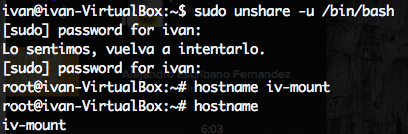
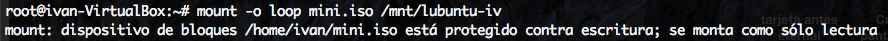
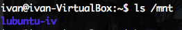
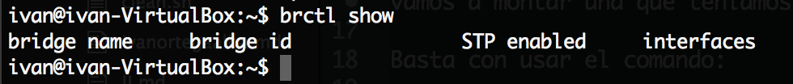
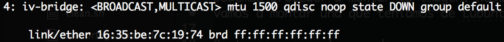
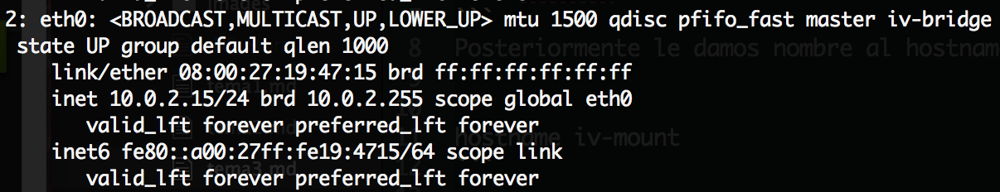
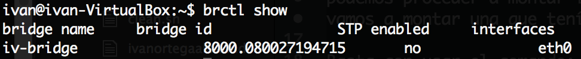

# Hito 3
## Ejercicio 1
Empezamos creando el nuevo espacio de nombres

```
sudo unshare -u /bin/bash
```
Posteriormente le damos nombre al hostname.

```
hostname iv-mount
```



Ya tenemos nuestro espacio de nombres, ahora podemos proceder a montar la imagen. Nosotros vamos a montar una que teníamos de Lubuntu.

Basta con usar el comando:

```
mount -o loop mini.iso /mnt/lubuntu-iv
```
Y nos montará nuestra imagen en el directorio lubuntu-iv



Podemos comprobarlo listando /mnt



## Ejercicio 2

1. Mostrar los puentes configurados en el sistema operativo.
Para mostrar los puentes, basta con ejecutar la orden

```
brctl show
```
Y como podemos ver no se muestra ninguno en este momento, ya que no tenemos ningun software de virtualización en este momento.


2. Crear un interfaz virtual y asignarlo al interfaz de la tarjeta wifi, si se tiene, o del fijo, si no se tiene.

Para crear una nueva interfaz virtual, basta con usar el comando

```
sudo brctl addbr iv-bridge
```

Y ya tendremos una nueva interfaz de puente, sin asignar a ninguna otra interfaz.

Este será el siguiente paso, y ejecutaremos:
```
sudo brctl addif iv-bridge eth0
```
Y quedará asignado a la interfaz Ethernet 0 de nuestro pc, ya que no disponemos de wlan. Como podemos ver, la interfaz se muestra como master de nuestro punete asociado:

Y si visualizamos los puentes de los que consta nuestro SO vemos:

