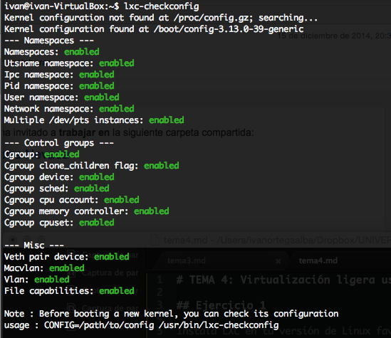
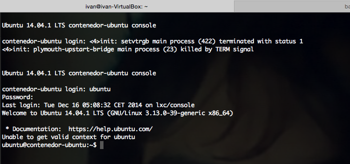
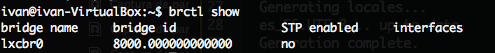

# TEMA 4: Virtualización ligera usando contenedores

## Ejercicio 1

Instala LXC en tu versión de Linux favorita. Normalmente la versión en desarrollo, disponible tanto en GitHub como en el sitio web está bastante más avanzada; para evitar problemas sobre todo con las herramientas que vamos a ver más adelante, conviene que te instales la última versión y si es posible una igual o mayor a la 1.0.

```
ivan@ivan-VirtualBox:~$ sudo apt-get install lxc
```
Comprobamos compatibilidad con:

```
lxc-checkconfig
```


## Ejercicio 2

Creamos el contenedor instalando ubuntu en el:

```
ivan@ivan-VirtualBox:~$ sudo lxc-create -t ubuntu -n contenedor-ubuntu
  [...]
  Download complete
  Copy /var/cache/lxc/trusty/rootfs-amd64 to /var/lib/lxc/contenedor-ubuntu/rootfs ...
  Copying rootfs to /var/lib/lxc/contenedor-ubuntu/rootfs ...
  Generating locales...
  es_ES.UTF-8... up-to-date
  Generation complete.
  Creating SSH2 RSA key; this may take some time ...
  Creating SSH2 DSA key; this may take some time ...
  Creating SSH2 ECDSA key; this may take some time ...
  Creating SSH2 ED25519 key; this may take some time ...
  update-rc.d: warning: default stop runlevel arguments (0 1 6) do not match ssh Default-Stop values (none)
  invoke-rc.d: policy-rc.d denied execution of start.

  Current default time zone: 'Europe/Madrid'
  Local time is now:      Tue Dec 16 05:01:21 CET 2014.
  Universal Time is now:  Tue Dec 16 04:01:21 UTC 2014.


  ##
  # The default user is 'ubuntu' with password 'ubuntu'!
  # Use the 'sudo' command to run tasks as root in the container.
  ##

```
Nos conectamos al contenedor:

```
ivan@ivan-VirtualBox:~$ sudo lxc-start -n contenedor-ubuntu
```



Vemos que efectivamente existen tales puentes:



# Ejercicio 3

Crear y ejecutar un contenedor basado en Debian.

Para ello usamos el mismo comando que antes, solo que cambiamos el SO:

```
ivan@ivan-VirtualBox:~$ sudo lxc-create -t debian -n contenedor-debian
```

# Ejercicio 4

Nos descargamos el script en la carpeta templates, tal y como indica Óscar en la docu:

ivan@ivan-VirtualBox:~$ sudo wget -P /usr/share/lxc/templates/ https://raw.github.com/globalcitizen/lxc-gentoo/master/lxc-gentoo

Le damos permisos de ejecución:

```
ivan@ivan-VirtualBox:~$ chmod +x /usr/share/lxc/templates/lxc-gentoo
```

Ahora, creamos el contenedor:

```
/usr/share/lxc/templates/lxc-gentoo create
```
