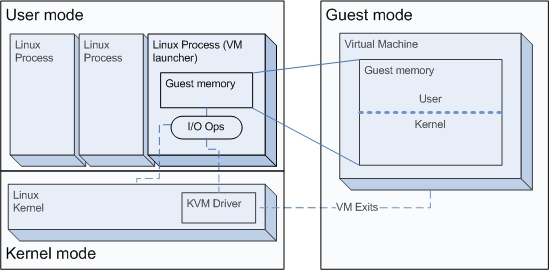

#####Comprobar si el procesador o procesadores instalados tienen estos flags. ¿Qué modelo de procesador es? ¿Qué aparece como salida de esa orden?

Conocer la información de nuestro procesador es muy fácil:

```sh
$ cat /proc/cpuinfo | grep "model name"
model name	: Intel(R) Core(TM)2 Duo CPU     T5450  @ 1.66GHz
model name	: Intel(R) Core(TM)2 Duo CPU     T5450  @ 1.66GHz
```

En este caso vemos que tenemos dos procesadores.


Como sabemos, KVM sólo está activado si se puede usar la acelarción por hardware del procesador, para comprobar si en nuestro caso esto es así ejecutamos:

```sh
> egrep '^flags.*(vmx|svm)' /proc/cpuinfo
//Sin salida
> egrep -c "vmx" /proc/cpuinfo 
0
```
Con la primera orden no obtenemos salida mientras que en la segunda si la respuesta ha sido 0 (como en este caso) el procesador no soporta el tipo de virtualización hardware.

