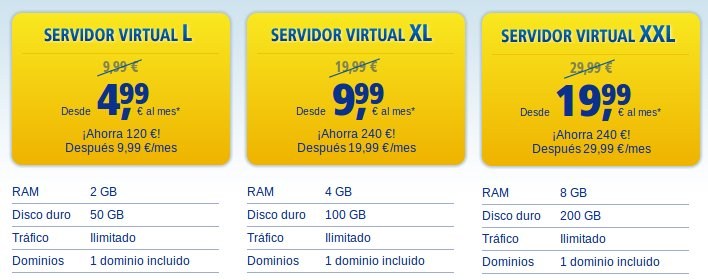
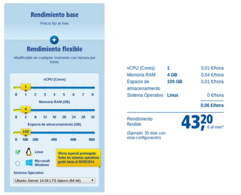

###Ejercicio 2

++Usando las tablas de precios de servicios de alojamiento en Internet y de proveedores de servicios en la nube, Comparar el coste durante un año de un ordenador con un procesador estándar (escogerlo de forma que sea el mismo tipo de procesador en los dos vendedores) y con el resto de las características similares (tamaño de disco duro equivalente a transferencia de disco duro) si la infraestructura comprada se usa sólo el 1% o el 10% del tiempo.++

La primera comparación que vamos a hacer es la de los servicios que nos ofrece www.1and1.es. Esta empresa estadounidense ofrece la posibilidad de contratar sus servidores virtuales de la forma tradicional con pago mensual independientemente del uso que se le de a la máquina, pero también incluye la opción de uso bajo demanda, tarificado por horas el consumo.

Partamos de la hipótesis de que necesitamos un servidor para alojar la web de un congreso que estamos organizando y que necesitaremos usar durante los próximos 6 meses. 

La oferta de 1and1 en servidores virtuales puede verse resumida en el siguiente extracto de su página:

En nuestro caso elegiremos la opción XL que tiene un precio de 20€/mes (9,99€ es el precio de contrataciónd el servicio a 24meses) ya que sólo lo vamos a necesitar seis meses. Eligiendo esta opción al final acabaremos pagando:

						20,00€ x 6meses = 120€

Y esto será independientemente del uso que hagamos del mismo.

Por otra parte podemos elegir el servicio bajo demanda que ofrecen. Mediante la calculadora de coste podemos configurar una máquina de prestaciones similares a la XL.

Como se puede observar si la máquina estuviera encendida las 24h como el servidor virtual el precio es claramente superior, pero como se dice en el enunciado, supongamos que el uso de esta máquina será del 1% o 10% del total contratado (imaginemos que sólo conectaremos el servidor para hacer pruebas de producción y que sólo se conectará de forma continua el día del congreso). En ese caso:

Para un uso aproximado del **1% del tiempo**, se usará unas:

			1% de (6meses=180días=4320horas) = 43,2horas 

que supondrían un coste bajo demanda de:

			43,2horas x 0,06€/h = 2,592€

Es decir, estaríamos ahorrando: 

			117,4€ (120€-2,60€) 
            El coste sería un 2,15% del precio original.

Para un **10% del tiempo**:

			10% de (6meses=180días=4320horas) = 432 horas 

que supondrían un coste de:

			432horas x 0,06€/h = 25,92€

Estaríamos ahorrando:

			94,08€ (120€-25,92€) 
            El coste sería un 21,6% del precio original.

#####Conclusiones:

Para casos en los que la máquina no sea necesario que esté constantemente operativa la configuración bajo demanda es la más razonable atendieno al coste. Sin embargo la solución cloud para una máquina que debe estar siempre operativa es 2,16 veces más cara y no sería la elección más económica.

Enlaces relacionados:

* [1and1] - Sección de servidores virtuales
* [1and1 Cloud] - Calculadora de costes cloud

[1and1]:http://www.1and1.es/servidores-virtuales?ac=OM.WE.WE861K62620T7073a&s_kwcid=AL!3115!3!41921715648!e!!g!!virtual%20server&ef_id=U2H9VgAABe1INZW3:20140930183440:s

[1and1 Cloud]: http://www.1and1.es/servidor-cloud-dinamico?linkOrigin=servidores-virtuales&linkId=ct.btn.more.cloud&ordernow=true

