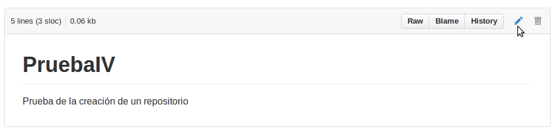

#Ejercicio 6

####1. Crear un proyecto y descargárselo con git. 

Crear un proyecto en GitHub es algo muy sencillo. Accedemos a la plataforma con nuestro nombre de usuario y contraseña y desde nuestra ventana principal de usuario nos dirigimos a la sección  **Respositories**.

Una vez allí justo debajo veremos una barra donde nos aparece un buscador de ficheros, algunas opciones de visualización y un boton verde con la palabra **New**.


Desde alí nos llevará a una sección deonde especificaremos el nombre del respositorio, una pequeña descripción opcional y el tipo (público si queremos que sea gratuito y privado que acarreará un coste). Seleccionamos la opción de inicializar incluyendo el fichero README que más tarde editaremos y pulsamos en **Create Repository**.


Después nos llevará a la sección principal de nuestro repositorio ya creado donde vemos el único archivo que tiene.


Ahora vamos a modificar el fichero README.md como una primera aproximación al trabajo con GitHub. Las modificaciones de los ficheros pueden hacerse principalmente de dos formas.

#####1.Trabajando desde el portal web

Es la opción menos recomendada ya que excepto para hacer alguna modificación en comentarios o en ficheros explicativos no tiene mucho más sentido. No es lógico editar código en la plataforma donde no podremos saber si funciona o no.
Aun así para hacer una pequeña modificación es muy útil.

Para hacerlo así sólo tendremos que pinchar en el fichero que queramos modificar, README.md que nos llevará a otra página donde veremos el contenido de sólo ese fichero.



Ahí vemos algunas opciones, entre ellas la de editar o eliminar el fichero. Si seleccionamos editar nos lleva a un editor donde podemos escribir. Una vez hecha la modificación podemos aceptarla haciendo un commit (publicación con comentario) o cancelarla.


La actualización se hace mediante un commit (commentario) y una breve explicación opcional. Una vez pulsemos **Commit changes** la actualización quedará realizada, asociada y registrada con nuestro commit.


#####2.Trabajando desde nuestro local

Para poder trabajar con el proyecto en nuestro equipo local debemos clonar antes el proyecto, para eso debemos tener instalado git, para eso:

```sh
sudo apt-get install git
```

Una vez instalado podemos clonar el repositorio mediante:

```sh
git clone git@github.com:<usuario>/<repositorio>.git
```
En enlace para clonar el repositorio lo podemos encontrar en la parte inferior derecha de la página principal, además vemos que nos ofrece más opciones de descarga.


Ahora lo clonamos en un lugar de nuestro equipo, donde se creará una carpeta con el mismo nombre que el.


Una vez clonado sólo tenemos que modificar README.md, indicarle a git que registre el cambio, comentar cual ha sido el cambio y subirlo así:

```sh
echo "Añado una linea" >> README.md
git add README.md
git commit -m "Modificado README.md"
git push
```


**Más en:**


* [Pro Git] - Libro oficial de Scott Chacon descargable gratuitamente.
* [Aprende Git] - Libro libre de J.J. Merelo y Angel P. Hinojosa


[Pro Git]:http://git-scm.com/book/es/
[Aprende Git]:https://github.com/oslugr/curso-git


