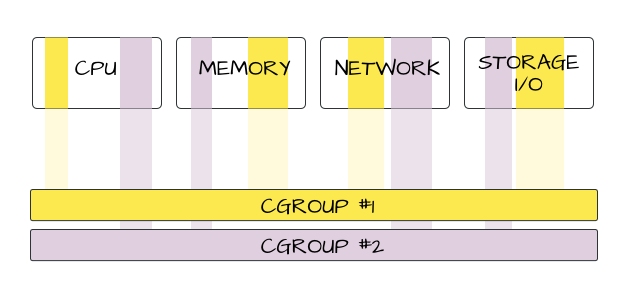
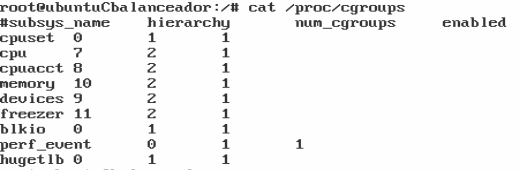

#cgroups



##Introducción

Para hacer las pruebas levantamos una máquina virtual con Ubuntu 12.04 Desktop (por ejemplo) y realizamos la instalación de 

apt-get install libcgroup-dev

apt.get install cgroup-bin 


Se crea el fichero 
**/proc/cgroups**

Y

**/etc/cgconfig.conf**

**/etc/cgrules.conf**


Para saber si está funcionando hacemos: service cgconfig status

##Repasando los ficheros relevantes

[/etc/cgconfig.conf](http://manpages.ubuntu.com/manpages/lucid/man5/cgconfig.conf.5.html)

Se trata del fichero de configuración que usa libcgroup para definir el control de grupos de usuarios. El fichero se divide en dos partes, la sección del montaje y la sección de los grupos. El orden en el que aparezcan es indiferente y será un comentario toda aquella linea que esté indicada con almohadilla (#). Por defecto todo el fichero está comentado.

Sección mount:

```sh
mount{
	<controlador>=<ruta>
    ...
}
```
Donde controlador es el nombre del subsistema del kernel. Libcgroup une todos los subsistemas montados en el mismo directorio y este es montado tan sólo una vez. Ruta es la ruta del directorio donde se montará la jerarquía asociada al controlador. Al incial el servicio cgconfig el directorio se creará automáticamente si no existe y borra al apagar el servicio.


Sección de grupos:

```sh
  group section has the form:

              group <name> {
                     [permissions]
                     <controller> {
                             <param name> = <param value>;
                             ...
                     }
                     ...
              }
```

Nombre: es el nombre del grupo de control, sólo puede contener caracteres y se permiten nombres de directorios. Estos grupos de control forman un árbol, un grupo puede contener a más grupos. Estos subgrupos pueden especificarse con el delimitador /.

```sh
 perm {
                               task {
                                      uid = <task user>;
                                      gid = <task group>;
                               }
                               admin {
                                      uid = <admin name>;
                                      gid = <admin group>;
                               }
                        }

```

Donde task user y group se refiere al usuario y los miembros del grupo que tienen acceso de escritura al archivo


Para saber los subsistemas del kernel que podemos controlar consultamos el fichero **/proc/cgroups**



Pra ver los directorios de las secciones del kernel:
** /sys/fs/crgroup **

Para listar los cgroups del sistema ejecutarmos **lscgroup**

c
