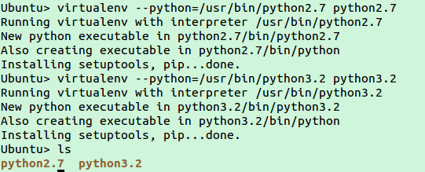
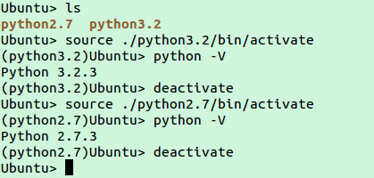

#virtualenv for Python

###Instalación
Instalación para versiones basadas en Debian como Ubuntu

```sh
sudo apt-get install aptitude 
aptitude install libc6-dev python-dev python-setuptools
easy_install virtualenv
```

###Creación de entornos locales

Para crear los entornos virtuales debemos tener nosotros instalado en nuestro sistema antes las versiones de python que queremos usar, estas podemos verlas con ** ll /etc/bin/python* **

Creamos los entornos para dos versiones con :

** virtualenv --python=/usr/bin/python2.7 python2.7**

** virtualenv --python=/usr/bin/python3.2 python3.2**

dentro de una carpeta que creamos para esto, virtualenv

Si después hacemos ls donde estamos vemos las carpetas de los entornos creados:




###Uso 

Para usar un entorno virual sólo tenemos que ejecutar **source** e indicar llegar hasta **activate** de la carpeta.
Cuando estemos dentro de un entorno podemos comprobar la versión de python en la que estamos trabajando y vemos que coincide. En este entorno podremos instalar frameworks y usar librerías que funcionarán de forma independiente en cada entorno virtual. Así podremos probar versiones de nuestro código en distintas versiones con distintas librerías.



