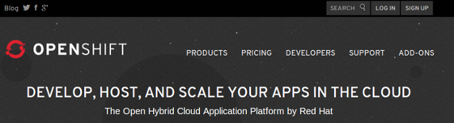
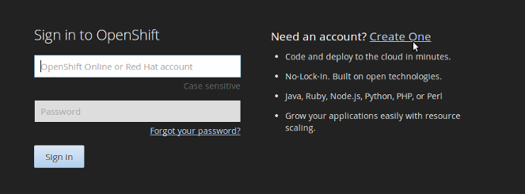
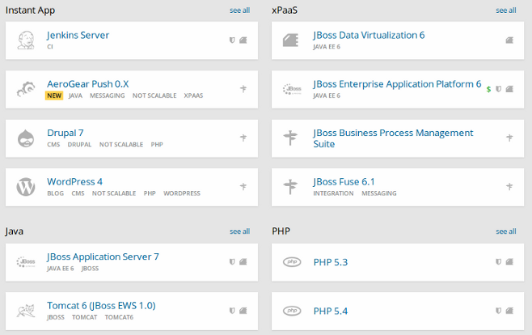

#[OpenShift](https://www.openshift.com/)

##Registro y concepto

Entramos en OpenShift y vemos todos los productos (algunos gratuitos) y precios que ofrecen. En **Sing Up** creamos una cuenta y entramos a la plataforma.

Una vez accedamos a nuestra cuenta podemos lanzar aplicacioens de forma extremadamente sencilla. Esta solución no es tan versatil como tener una máquina virtual donde poder realizar las instalaciones y modificaciones necesarias pero ofrece una solución rápida para lanzar aplicaciones complejas sin preocuparnos por el proceso de instalación ni por el servidor donde esté alojado ni por el dominio de acceso.

OpenShift ofrece una amplia gama de aplicaciones, para muchos lenguajes, por ejemplo:

