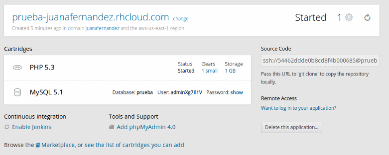

#[OpenShift](https://www.openshift.com/)
##Creación de WordPress

Crear una aplicación en OpenShift es tan fácil como pinchar en Add Application dentro de la pestaña Applications.

Dentro del catálogo de Aplicaciones Instantaneas elegimos WordPress 4

Tras pinchar en **Create Application** OpenShift procederá a crear el espacio virtual necesario para nuestra aplicación en algun lugar y se encarga de instalar todo lo necesario para que funcione, php, mysql, etc.

El proceso es realmente rápido y en unos segundos tendremos lista la configuración, devolviendonos un enlace para WordPress.

