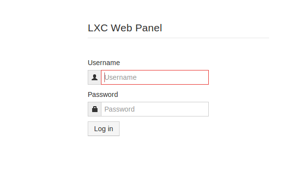
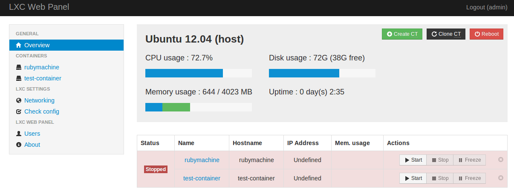
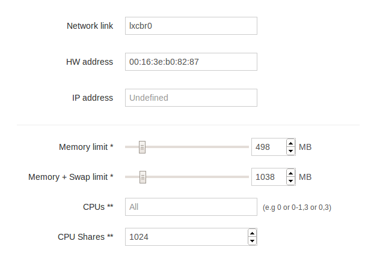

#Ejercicio 4 

####1. Instalar lxc-webpanel y usarlo para arrancar, parar y visualizar las máquinas virtuales que se tengan instaladas.

Suponiendo que tenemos instalado lxc, para instalar el webpanel seguimos el manual [manual](https://lxc-webpanel.github.io/install.html) y ejecutamos, como superusuario:

    wget http://lxc-webpanel.github.io/tools/install.sh -O - | bash

El proceso comenzará...

~~~bash
_     __   _______  __          __  _       _____                 _
| |    \ \ / / ____| \ \        / / | |     |  __ \               | |
| |     \ V / |       \ \  /\  / /__| |__   | |__) |_ _ _ __   ___| |
| |      > <| |        \ \/  \/ / _ \ '_ \  |  ___/ _` | '_ \ / _ \ |
| |____ / . \ |____     \  /\  /  __/ |_) | | |  | (_| | | | |  __/ |
|______/_/ \_\_____|     \/  \/ \___|_.__/  |_|   \__,_|_| |_|\___|_|

Automatic installer

Installing requirement...
~~~

terminando con la confirmación del proceso:

~~~bash
Installation complete!

Adding /etc/init.d/lwp...
Done
Starting server...done.
Connect you on http://your-ip-address:5000/

~~~

Ya podremos acceder desde un navegador a http://localhost:5000/

donde *Username* y *Password* son admin.

Dentro veremos algo parecido a esto:

una interfaz de control de las máquinas virtuales creadas, en este caso dos, *rubymachine* y *test-container* e información del host donde se ejecuta LXC, Ubuntu 12.04 en este caso.

####2. Desde el panel restringir los recursos que pueden usar: CPU shares, CPUs que se pueden usar (en sistemas multinúcleo) o cantidad de memoria.

Dentro del web pnael si pinchamos en una de las máquinas creadas accederemos a su pangel de configuración donde entre otras cosas, podremos modificar la cantidad de memoria usada, el número de CPUs o su información de red.

